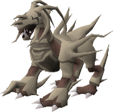
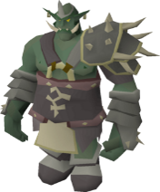
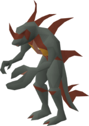
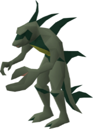
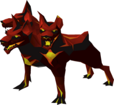
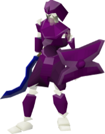

# Boosts & Requirements

Image needs updating 

| Boss | Boost\(s\) | Required items |
| :--- | :--- | :--- |
|    |     | Zamorakian Spear |
|   |       |  |
|   |   |  |
|   |  |  |
|   |  |  |
|   |  |  |
|   |  |  |
|    |  |  |
|   |  |  |
|   |  |  |
|   |  |  |
|   |  |  |
|   |  |  |
|   |  |  |
|   |  |  |
|   |  |  |
|   |  |  |
|   |  |  |
|    |  |  |
|  |  |  |
|  |  |  |
|  |  |  |
|  |  |  |
|  |  |  |
|  |  |  |
|  |  |  |

