# Boosts & Requirements

You can check the boosts for a specific boss and by how much by using the `+monster NameOfBoss` command. Some boosts don't currently appear so it is advised you crosscheck against this chart.

### Global Boosts

 Elysian Spirit Shield: Reduces food usage by 17.6% when equipped in the gear setup being used.

Black Mask \(i\): Gives a 15% boost while killing monsters on a slayer task.

Refer to the [Slayer Boosts](https://wiki.oldschool.gg/skills/slayer/slayer-boosts) page for more information on boosts that apply to generic slayer monsters.

#### God Wars Dungeon



**Requirements**  
43 Prayer  
70 Strength  
75 Quest Points  
  
**Boosts**  
5% for Bandos Godsword OR 10% for Dragon Warhammer



**Requirements**  
43 Prayer  
70 Agility  
75 Quest Points  
Karil's Leathertop OR Armadyl Chestplate  
Karil's Leatherskirt OR Armadyl Chainskirt  
  
**Boosts**  
3% for Ranger Boots OR 5% for Pegasian Boots  
3% for Armadyl Crossbow OR 10% for Twisted Bow



**Requirements**  
43 Prayer  
70 Ranged  
75 Quest Points  
Karil's Leathertop OR Armadyl Chestplate  
Karil's Leatherskirt OR Armadyl Chainskirt  
  
**Boosts**  
5% for Armadyl Crossbow OR 10% for Twisted Bow



**Requirements**  
43 Prayer  
70 Hitpoints  
75 Quest Points  
Karil's Leathertop OR Armadyl Chestplate  
Karil's Leatherskirt OR Armadyl Chainskirt  
  
**Boosts**  
3% for Dragon Claws OR 5% for Bandos Godsword OR 10% for Dragon Warhammer  
9% for Arclight



#### Dagannoth Kings



**Requirements**  
43 Prayer  
****Full Guthan's  
Bandos Chestplate OR Torag's Platebody  
Bandos Tassets OR Torag's Platelegs

**Boosts**  
3% for Iban's Staff OR 5% for Harmonised Nightmare Staff  
5% for Occult Necklace



**Requirements**  
43 Prayer  
****Full Guthan's  
Armadyl Chestplate OR Karil's Leathertop  
Armadyl Chainskirt OR Karil's Leatherskirt

**Boosts**  
2% for Armadyl Chestplate  
2% for Armadyl Chainskirt  
6% for Twisted Bow



**Requirements**  
43 Prayer  
****Full Guthan's  
Bandos Chestplate OR Torag's Platebody  
Bandos Tassets OR Torag's Platelegs

**Boosts**  
2% for Bandos Chestplate  
2% for Bandos Tassets  
4% for Saradomin Godsword OR 6% for Dragon Claws



#### Wilderness Bosses



**Requirements**  
Full Verac's  
  
**Boosts**  
3% for Berserker Ring OR 5% for Berserker Ring \(i\)  
3% for Barrows Gloves  
25% for Viggora's Chainmace



**Requirements**  
Full Verac's  
  
**Boosts**  
3% for Dragon Warhammer  
25% for Viggora's Chainmace



**Requirements**  
Full Verac's  
  
**Boosts**  
3% for Barrows Gloves  
25% for Craw's Bow



**Requirements**  
Black D'hide Body OR Karil's Leathertop  
Black D'hide Chaps OR Karil's Leatherskirt  
  
**Boosts**  
3% for Barrows Gloves  
3% for Archers Ring OR 5% for Archers Ring \(i\)  
25% for Craw's Bow



#### Wilderness Demi-bosses



**Requirements**  
None  
  
**Boosts**  
10% for Occult Necklace  
10% for Harmonised Nightmare Staff



**Requrements**  
None  
  
**Boosts**  
3% for Karil's Leathertop  
3% for Karil's Leatherskirt  
25% for Craw's Bow



**Requirements**  
None  
  
**Boosts**  
10% for Occult Necklace





**Requirements**  
Food & Melee gear.

**Boosts**  
See [The Nightmare](https://wiki.oldschool.gg/minigames/nightmare-of-ashihama) for boosts.



**Requirements**

**Boosts**



**Requirements**

**Boosts**



**Requirements**

**Boosts**



**Requirements**  
30 quest points  
Karil's crossbow OR Rune crossbow OR Armadyl crossbow OR Toxic blowpipe OR Toxic blowpipe \(empty\)

**Boosts**  
3% for Ring of the gods, \(8% for Armadyl crossbow OR 10% for Toxic blowpipe \(empty\) OR 15% for Toxic blowpipe\)



**Requirements**

**Boosts**



**Requirements**

**Boosts**



Requirements  
Anti-Dragon Shield  
Armadyl Crossbow OR Rune Crossbow OR Twisted Bow OR Dragon Hunter Crossbow  
Black D'hide Body OR Karil's Leathertop  
Black D'hide Chaps OR Karil's Leatherskirt  
  
Boosts  
6% for Armadyl Crossbow OR 10% for Twisted Bow  
15% for Dragon Hunter Lance \(when training melee\)  
15% for Dragon Hunter Crossbow \(when training range\)



#### Slayer bosses



**Requirements**  
85 Slayer

**Boosts**  
10% for Arclight  
5% for Bandos godsword OR 10% for Dragon warhammer  
10% for Rejuvenation pool \(or higher\)



**Requirements**  
75 Slayer  
Brittle key

**Boosts**  
3% for Armadyl crossbow OR 5% for Toxic blowpipe  
6% for Saradomin godsword OR 10% for Dragon claws  
10% for Scythe of vitur OR 10% for Scythe of vitur \(uncharged\)

Charged blowpipe and Scythe of vitur are currently unobtainable on OSB.



**Requirements**  
87 Slayer  
Trident of the seas OR Trident of the seas \(full\) OR Uncharged trident OR Uncharged toxic trident OR Trident of the swamp OR Sanguinesti staff OR Harmonised nightmare staff

**Boosts**  
8% for Trident of the seas \(full\) OR 5% for Trident of the seas OR 5% for Uncharged trident OR 10% for Trident of the swamp OR 10% for Uncharged toxic trident OR 12% for Sanguinesti staff OR 15% for Harmonised nightmare staff

Staves cannot currently be manually charged and Sanguinesti staff is currently unobtainable.



**Requirements**  
91 Slayer  
Torag's platebody OR Dharok's platebody OR Bandos chestplate  
Torag's platelegs OR Dharok's platelegs OR Bandos tassets  
Zamorakian spear OR Zamorakian hasta

**Boosts**  
10% for Spectral spirit shield  
5% for Bandos chestplate OR 8% for Inquisitor's hauberk  
5% for Bandos tassets OR 8% for Inquisitor's plateskirt  
8% for Arclight OR 10% for Abyssal whip OR 11% for Abyssal tentacle OR 13% for Abyssal bludgeon OR 15% for Inquisitor's mace



**Requirements**  
93 Slayer

**Boosts**  
3% for Dragon dagger OR 8% for Dragon claws  
5% for Trident of the seas OR 5% for Uncharged trident OR 6% for Trident of the swamp OR 6% for Uncharged toxic trident OR 8% for Harmonised nightmare staff  
5% for Occult necklace  
2% for Ancestral robe bottom  
3% for Ancestral robe top



**Requirements**  
95 Slayer  
1 Antidote++ \(4\) per 6 kills \(approx.\)

**Boosts**  
10% for Twisted bow  
3% for Barrows gloves OR 6% for Ferocious gloves  
8% for Saradomin godsword OR 10% for Dragon claws  
15% for Dragon hunter crossbow OR 15% for Dragon hunter lance

_Must be training range/melee for DHCB/DHL boost._



\(Please drop a message in \#wiki if you find any monsters not listed on the [Slayer Boosts](https://wiki.oldschool.gg/skills/slayer/slayer-boosts) page or here. Include a screenshot.\)

<table>
  <thead>
    <tr>
      <th style="text-align:center">Monster</th>
      <th style="text-align:center">Boost(s)</th>
      <th style="text-align:center">Required items</th>
      <th style="text-align:center">Required stats/QP</th>
    </tr>
  </thead>
  <tbody>
    <tr>
      <td style="text-align:center">
        
      </td>
      <td style="text-align:center">
        
        
        
      </td>
      <td style="text-align:center">
        
      </td>
      <td style="text-align:center">43 Prayer</td>
    </tr>
    <tr>
      <td style="text-align:center">
        
      </td>
      <td style="text-align:center">
        

          OR
          
           OR
          
        

        

          
        

      </td>
      <td style="text-align:center">
        
      </td>
      <td style="text-align:center">
        
75 QP

        
43 Prayer

      </td>
    </tr>
    <tr>
      <td style="text-align:center">
        
      </td>
      <td style="text-align:center">
        OR
        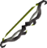
      </td>
      <td style="text-align:center">
        
      </td>
      <td style="text-align:center">
        
75 QP

        
43 Prayer

      </td>
    </tr>
    <tr>
      <td style="text-align:center">
        
      </td>
      <td style="text-align:center">
        

          OR
          
        

        

          OR
          
        

      </td>
      <td style="text-align:center">
        
      </td>
      <td style="text-align:center">
        
75 QP

        
43 Prayer

        
70 Agility

      </td>
    </tr>
    <tr>
      <td style="text-align:center">
        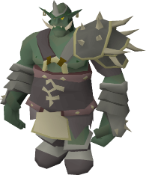
      </td>
      <td style="text-align:center">
        OR
        
      </td>
      <td style="text-align:center"></td>
      <td style="text-align:center">
        
75 QP

        
43 Prayer

      </td>
    </tr>
    <tr>
      <td style="text-align:center">
        
      </td>
      <td style="text-align:center">
        
        
        
      </td>
      <td style="text-align:center">
        

          
          
          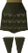
          
        

        

          
        

      </td>
      <td style="text-align:center">43 Prayer</td>
    </tr>
    <tr>
      <td style="text-align:center">
        
      </td>
      <td style="text-align:center">
        OR
        
         
        
      </td>
      <td style="text-align:center">
        

          
          
          
          
        

        

          
        

      </td>
      <td style="text-align:center">43 Prayer</td>
    </tr>
    <tr>
      <td style="text-align:center">
        
      </td>
      <td style="text-align:center">
        
        
         
        OR
        
      </td>
      <td style="text-align:center">
        
&#x200B;&#x200B;
          &#x200B;&#x200B;
          &#x200B;&#x200B;
          &#x200B;&#x200B;
          &#x200B;

        
&#x200B;&#x200B;
          
        

      </td>
      <td style="text-align:center">43 Prayer</td>
    </tr>
    <tr>
      <td style="text-align:center">
        
      </td>
      <td style="text-align:center">
        OR
        
      </td>
      <td style="text-align:center">
        
        
        
        
      </td>
      <td style="text-align:center"></td>
    </tr>
    <tr>
      <td style="text-align:center">
        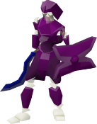
      </td>
      <td style="text-align:center">
        
      </td>
      <td style="text-align:center">
        
        
        
        
      </td>
      <td style="text-align:center"></td>
    </tr>
    <tr>
      <td style="text-align:center">
        
      </td>
      <td style="text-align:center">
        
      </td>
      <td style="text-align:center">
        
        
        
        
      </td>
      <td style="text-align:center"></td>
    </tr>
    <tr>
      <td style="text-align:center">
        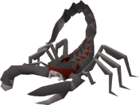
      </td>
      <td style="text-align:center">
        
        
      </td>
      <td style="text-align:center"></td>
      <td style="text-align:center"></td>
    </tr>
    <tr>
      <td style="text-align:center">
        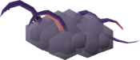
      </td>
      <td style="text-align:center">
        

          OR
          
        

        

          
        

      </td>
      <td style="text-align:center">
        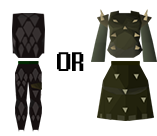
      </td>
      <td style="text-align:center"></td>
    </tr>
    <tr>
      <td style="text-align:center">
        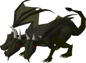
      </td>
      <td style="text-align:center">
        OR
        OR
        OR
        
      </td>
      <td style="text-align:center">
        

          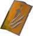
           
          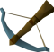OR
          OR
          OR
          
           
          
        

        

      </td>
      <td style="text-align:center"></td>
    </tr>
    <tr>
      <td style="text-align:center">
        
      </td>
      <td style="text-align:center">
        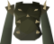
        
      </td>
      <td style="text-align:center"></td>
      <td style="text-align:center"></td>
    </tr>
    <tr>
      <td style="text-align:center">
        
      </td>
      <td style="text-align:center">
        
      </td>
      <td style="text-align:center"></td>
      <td style="text-align:center"></td>
    </tr>
    <tr>
      <td style="text-align:center">
        
      </td>
      <td style="text-align:center">
        

          
        

        

          OR
          
        

        
OR
          
        

      </td>
      <td style="text-align:center">
        
        
        
        
      </td>
      <td style="text-align:center">43 Prayer</td>
    </tr>
    <tr>
      <td style="text-align:center">
        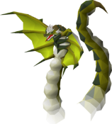
      </td>
      <td style="text-align:center">
        

          OR
          
        

        

          OR
          
        

        

          
          
          
        

        

          
          
        

      </td>
      <td style="text-align:center"></td>
      <td style="text-align:center">
        
75 QP

        
43 Prayer

      </td>
    </tr>
    <tr>
      <td style="text-align:center">
        
      </td>
      <td style="text-align:center">
        

          OR
          
           OR
          
        

        

          OR
          
        

      </td>
      <td style="text-align:center">
        
        
      </td>
      <td style="text-align:center">
        
205 QP

        
43 Prayer

      </td>
    </tr>
    <tr>
      <td style="text-align:center">
        
      </td>
      <td style="text-align:center">
        
        
        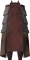
        
      </td>
      <td style="text-align:center">150 slash defense and 80 crush attack in melee setup.</td>
      <td style="text-align:center">43 Prayer</td>
    </tr>
    <tr>
      <td style="text-align:center">
        
      </td>
      <td style="text-align:center">
        
      </td>
      <td style="text-align:center">177 ranged defense, 73 stab defense, and 65 crush attack in melee setup.</td>
      <td
      style="text-align:center">43 Prayer</td>
    </tr>
    <tr>
      <td style="text-align:center">
        
      </td>
      <td style="text-align:center">
        
        
        
      </td>
      <td style="text-align:center">
        

          
          
        

        

          
        

      </td>
      <td style="text-align:center">43 Prayer</td>
    </tr>
    <tr>
      <td style="text-align:center">
        
      </td>
      <td style="text-align:center">
        

          
        

        

          OR
          
        

      </td>
      <td style="text-align:center">
        
      </td>
      <td style="text-align:center">
        
75 Slayer

        
(Must be on task.)

      </td>
    </tr>
    <tr>
      <td style="text-align:center">
        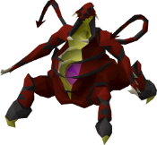
      </td>
      <td style="text-align:center">
        

          
        

        

          
        

        

          OR
          
        

      </td>
      <td style="text-align:center"></td>
      <td style="text-align:center">
        
85 Slayer

        
(Must be on task.)

      </td>
    </tr>
    <tr>
      <td style="text-align:center">
        
      </td>
      <td style="text-align:center">&#x200B;&#x200B;
        OR &#x200B;
        OR &#x200B;
        
         
      </td>
      <td style="text-align:center">
        OR
        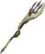OR
        
      </td>
      <td style="text-align:center">
        
87 Slayer

        
(Must be on task.)

      </td>
    </tr>
    <tr>
      <td style="text-align:center">
        
      </td>
      <td style="text-align:center">
        

          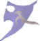
        

        

          OR
          
           
          
        

        

      </td>
      <td style="text-align:center">
        

          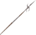OR
          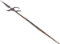
        

        

          
        

      </td>
      <td style="text-align:center">
        
91 Slayer

        
(Must be on task.)

      </td>
    </tr>
    <tr>
      <td style="text-align:center">
        
      </td>
      <td style="text-align:center">
        

          
        

        

          OR
          
        

        

          OR
          
           
          OR
          
        

      </td>
      <td style="text-align:center">
        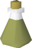
      </td>
      <td style="text-align:center">
        
95 Slayer

        
(Must be on task.)

      </td>
    </tr>
    <tr>
      <td style="text-align:center">
        
      </td>
      <td style="text-align:center">
        
      </td>
      <td style="text-align:center">
        
         (Consumed on use.)</td>
      <td style="text-align:center"></td>
    </tr>
    <tr>
      <td style="text-align:center">
        
        
      </td>
      <td style="text-align:center">
        
        
        
        
      </td>
      <td style="text-align:center"></td>
      <td style="text-align:center">43 Prayer</td>
    </tr>
    <tr>
      <td style="text-align:center">
        
      </td>
      <td style="text-align:center">
        

          
        

        

          OR
          
        

      </td>
      <td style="text-align:center">
        OR
        OR
        OR
        
      </td>
      <td style="text-align:center">
        
30 QP

        
43 Prayer

      </td>
    </tr>
  </tbody>
</table>

Original boost table for reference

