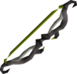

# Boosts & Requirements

Image needs updating  

<table>
  <thead>
    <tr>
      <th style="text-align:center">Boss</th>
      <th style="text-align:center">Boost(s)</th>
      <th style="text-align:center">Required items</th>
    </tr>
  </thead>
  <tbody>
    <tr>
      <td style="text-align:center">
        
      </td>
      <td style="text-align:center">
        
        
        
      </td>
      <td style="text-align:center">
        
      </td>
    </tr>
    <tr>
      <td style="text-align:center">
        
      </td>
      <td style="text-align:center">
        
        
        
      </td>
      <td style="text-align:center">
        

          
          
        

        

          
        

      </td>
    </tr>
    <tr>
      <td style="text-align:center">
        
      </td>
      <td style="text-align:center">
        
      </td>
      <td style="text-align:center"></td>
    </tr>
    <tr>
      <td style="text-align:center">
        
      </td>
      <td style="text-align:center">
        OR
        
      </td>
      <td style="text-align:center"></td>
    </tr>
    <tr>
      <td style="text-align:center">
        
      </td>
      <td style="text-align:center"></td>
      <td style="text-align:center"></td>
    </tr>
    <tr>
      <td style="text-align:center">
        
      </td>
      <td style="text-align:center"></td>
      <td style="text-align:center"></td>
    </tr>
    <tr>
      <td style="text-align:center">
        
      </td>
      <td style="text-align:center"></td>
      <td style="text-align:center"></td>
    </tr>
    <tr>
      <td style="text-align:center">
        
      </td>
      <td style="text-align:center"></td>
      <td style="text-align:center"></td>
    </tr>
    <tr>
      <td style="text-align:center">
        
      </td>
      <td style="text-align:center"></td>
      <td style="text-align:center"></td>
    </tr>
    <tr>
      <td style="text-align:center">
        
      </td>
      <td style="text-align:center"></td>
      <td style="text-align:center"></td>
    </tr>
    <tr>
      <td style="text-align:center">
        
      </td>
      <td style="text-align:center"></td>
      <td style="text-align:center"></td>
    </tr>
    <tr>
      <td style="text-align:center">
        
      </td>
      <td style="text-align:center"></td>
      <td style="text-align:center"></td>
    </tr>
    <tr>
      <td style="text-align:center">
        
      </td>
      <td style="text-align:center"></td>
      <td style="text-align:center"></td>
    </tr>
    <tr>
      <td style="text-align:center">
        
      </td>
      <td style="text-align:center"></td>
      <td style="text-align:center"></td>
    </tr>
    <tr>
      <td style="text-align:center">
        
      </td>
      <td style="text-align:center"></td>
      <td style="text-align:center"></td>
    </tr>
    <tr>
      <td style="text-align:center">
        
      </td>
      <td style="text-align:center"></td>
      <td style="text-align:center"></td>
    </tr>
    <tr>
      <td style="text-align:center">
        
      </td>
      <td style="text-align:center"></td>
      <td style="text-align:center"></td>
    </tr>
    <tr>
      <td style="text-align:center">
        
      </td>
      <td style="text-align:center"></td>
      <td style="text-align:center"></td>
    </tr>
    <tr>
      <td style="text-align:center">
        
        
      </td>
      <td style="text-align:center"></td>
      <td style="text-align:center"></td>
    </tr>
    <tr>
      <td style="text-align:center">
        
      </td>
      <td style="text-align:center"></td>
      <td style="text-align:center"></td>
    </tr>
    <tr>
      <td style="text-align:center">
        
      </td>
      <td style="text-align:center"></td>
      <td style="text-align:center"></td>
    </tr>
    <tr>
      <td style="text-align:center">
        
      </td>
      <td style="text-align:center"></td>
      <td style="text-align:center"></td>
    </tr>
    <tr>
      <td style="text-align:center">
        
      </td>
      <td style="text-align:center"></td>
      <td style="text-align:center"></td>
    </tr>
    <tr>
      <td style="text-align:center">
        
      </td>
      <td style="text-align:center"></td>
      <td style="text-align:center"></td>
    </tr>
    <tr>
      <td style="text-align:center">
        
      </td>
      <td style="text-align:center"></td>
      <td style="text-align:center"></td>
    </tr>
  </tbody>
</table>

