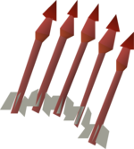
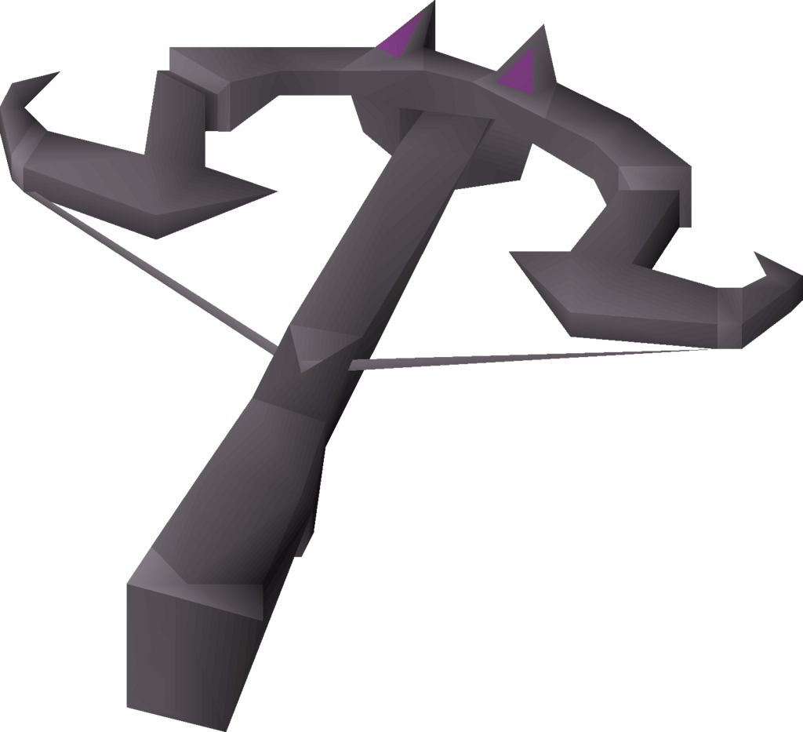

# Boosts & Requirements

You can check the boosts/requirements for a specific boss and by how much by using `+monster [name]`. Some boosts don't currently appear so it is advised you crosscheck against this chart.

### Global Boosts

 Elysian Spirit Shield: Reduces food usage by 17.5% when equipped in the gear setup being used.

Black Mask (i): Gives a 15% boost while killing monsters on a slayer task.

Refer to the [Slayer Boosts](https://wiki.oldschool.gg/skills/slayer/slayer-boosts) page for more information on boosts that apply to generic slayer monsters.

### God Wars Dungeon



**Requirements**

 43 Prayer

 70 Agility

  75 Quest Points

 Karil's Leathertop **OR** Armadyl Chestplate

&#x20; Karil's Leatherskirt **OR** Armadyl Chainskirt

****

**Boosts**

5% for  Armadyl Crossbow **OR** 7% for  Bow of Faerdhinen (c) **OR** 10% for  Twisted Bow

3% for  Ranger Boots **OR** 5% for  Pegasian Boots



**Requirements**

**** 43 Prayer

&#x20;  70 Strength

  75 Quest Points\
\
**Boosts**

5% for Bandos Godsword **OR** 10% for Dragon Warhammer



**Requirements**

 43 Prayer

 70 Ranged

&#x20; 75 Quest Points

 Karil's Leathertop **OR** Armadyl Chestplate

&#x20; Karil's Leatherskirt **OR** Armadyl Chainskirt

****

**Boosts**

5% for  Armadyl Crossbow **OR** 7% for  Bow of Faerdhinen (c) **OR** 10% for  Twisted Bow



**Requirements**

 43 Prayer

 70 Hitpoints

&#x20; 75 Quest Points\
 Karil's Leathertop **OR** Armadyl Chestplate

&#x20; Karil's Leatherskirt **OR** Armadyl Chainskirt

**Boosts**

9% forArclight OR **10**% forTwisted Bow

3% forDragon Claws **OR** 5% forBandos Godsword **OR** 10% forDragon Warhammer



**Requirements**

  90 Defence

 90 Ranged

 74 Prayer

&#x20;[Frozen Key](nex.md)

Zaryte Crossbow **OR** Armadyl Crossbow **OR** Dragon Crossbow **OR** Twisted Bow&#x20;

1,000,000 Coins in bank (Covers Death Cost)

**Resource Used Per Trip (Regardless of Length/Kills)**

 600 Ammo Equipped (50-60 used per kill before reductions)

.png) 8x Saradomin brew(4)

.png) 5x Super restore(4)

.png) 2x Ranging potion(4)

.png) 1x Sanfew serum(4)

**Boosts**

**-30%** chance of death for Elysian Spirit Shield



### Dagannoth Kings



**Requirements**

 43 Prayer

 Guthan's Helm

&#x20; ****   Guthan's Platebody

&#x20;   Guthan's Chainskirt

&#x20;Guthan's Warspear

 Karil's Leathertop **OR**  Armadyl Chestplate

&#x20; Karil's Leatherskirt **OR**  Armadyl Chainskirt

**Boosts**

6% for Twisted Bow

2% for  Armadyl Chestplate

2% for  Armadyl Chainskirt



**Requirements**

 43 Prayer

 Guthan's Helm

&#x20; ****   Guthan's Platebody

&#x20;   Guthan's Chainskirt

&#x20;Guthan's Warspear

&#x20;  Bandos Chestplate **OR**  Torag's Platebody

&#x20; Bandos Tassets **OR**  Torag's Platelegs

**Boosts**

3% for  Iban's Staff **OR** 5% for  Harmonised Nightmare Staff

5% for  Occult Necklace



**Requirements**

 43 Prayer

 Guthan's Helm

&#x20; ****   Guthan's Platebody

&#x20;   Guthan's Chainskirt

&#x20;Guthan's Warspear

&#x20;  Bandos Chestplate **OR**  Torag's Platebody

&#x20; Bandos Tassets **OR**  Torag's Platelegs

**Boosts**

4% for  Saradomin Godsword **OR** 6% for  Dragon Claws

2% for  Bandos Chestplate

2% for  Bandos Tassets



### Wilderness Bosses



**Requirements**

  Verac's Helm

  Verac's Brassard\
&#x20; Verac's Plateskirt

&#x20;  Verac's Chainmace

**Boosts**

25% for  Viggora's Chainmace&#x20;

3% for  Berserker Ring **OR** 5% .png) for Berserker Ring (i)

3% for  Barrows Gloves



**Requirements**

 Black D'hide Body **OR**  Karil's Leathertop

&#x20;Black D'hide Chaps **OR**  Karil's Leatherskirt

**Boosts**

25% for  Craw's Bow

3% for  Archers Ring **OR** 5% for .png) Archers Ring (i)

3% for  Barrows Gloves



**Requirements**

  Verac's Helm

  Verac's Brassard\
&#x20; Verac's Plateskirt

&#x20;  Verac's Chainmace

**Boosts**

25% for  Craw's Bow

3% for  Barrows Gloves



**Requirements**

  Verac's Helm

  Verac's Brassard\
&#x20; Verac's Plateskirt

&#x20;  Verac's Chainmace

**Boosts**

25% for  Viggora's Chainmace&#x20;

3% for  Dragon Warhammer



### Wilderness Demi-bosses



**Requirements**

None

**Boosts**

25% for  Craw's Bow

3% for  Karil's Leathertop

3% for   Karil's Leatherskirt



**Requirements**

None

**Boosts**

10% for  Occult Necklace



**Requirements**

None

**Boosts**

10% for  Occult Necklace

10% for  Harmonised Nightmare Staff



_**Note:** Item boosts for wilderness bosses must be **EQUIPPED** in order to work._

### Slayer bosses



**Requirements**

 85 Slayer

**Boosts**

10% for  Arclight

5% forBandos Godsword **OR** 10% forDragon Warhammer

10% for  POH Pool of Rejuvenation or better



**Requirements**

 95 Slayer

.png)1 Antidote++ (4) per \~12 kills **OR** .png) 1 Anti-venom (4) per \~12 kills **OR** .png) 1 Anti-venom+ (4) per \~15 kills

&#x20;****&#x20;

**Boosts**

10% for  Twisted Bow

3% for  Barrows Gloves **OR** 6% for  Ferocious Gloves

8% for .png>) Saradomin Godsword **OR** 10% for  Dragon Claws

15% for  Dragon Hunter Lance (when training melee) **OR** 15% for  Dragon Hunter Crossbow (when training range)



**Requirements**

 91 Slayer

 43 Prayer

 Dharok's Platebody **OR**  Bandos Chestplate **OR**  Torag's Platebody

&#x20;    Dharok's Platelegs **OR**  Bandos Tassets **OR**  Torag's Platelegs

 Zamorakian Spear **OR**  Zamorakian Hasta

**Boosts**

10% for  **** Spectral Spirit Shield

5% for  Bandos Chestplate **OR** 8% for  Inquisitor's Hauberk

5% for  Bandos Tassets **OR** 8% for  Inquisitor's Plateskirt

8% for  Arclight **OR** 10% for  Abyssal Whip **OR** 11% for  Abyssal Tentacle **OR** 13% for  Abyssal Bludgeon **OR** 15% for  Inquisitor's Mace



**Requirements**

 75 Slayer

 Brittle key

****

**Boosts**

3% for  Armadyl Crossbow **OR** 5% for  Toxic Blowpipe

6% for .png>) Saradomin Godsword **OR** 10% for  Dragon Claws

10% for  Scythe of Vitur **OR** 10% for .png) Scythe of Vitur (uncharged)



**Requirements**

 87 Slayer

****.png) **** Trident of the Seas **OR** .png>) Trident of the Seas (full) **OR** Uncharged Trident of the Seas **OR**  Uncharged Toxic Trident **OR**  Trident of the Swamp **OR**  Sanguinesti Staff **OR**  Harmonised Nightmare Staff

**Boosts**

5% for the .png) **** Trident of the Seas **OR** 8% for the .png>) Trident of the Seas (full) **OR** 5% for the Uncharged Trident of the Seas **OR** 10% for the Uncharged Toxic Trident **OR** 10% for the Trident of the Swamp **OR** 12% for the Sanguinesti Staff **OR** 15% for the  Harmonised Nightmare Staff

3% for  Imbued Heart

_**Note**: Tridents cannot currently be manually charged._



**Requirements**

 93 Slayer

****

**Boosts**

5% for the .png) **** Trident of the Seas **OR** 5% for the Uncharged Trident of the Seas **OR** 6% for the Uncharged Toxic Trident **OR** 6% for the Trident of the Swamp **OR** 8% for the  Harmonised Nightmare Staff

3% for  Dragon Dagger **OR** 8% for  Dragon Claws

5% for  Occult Necklace

5% for ****  Imbued Heart

3% for  Ancestral Robe Top

2% for  Ancestral Robe Bottom



### Sporadic Bosses



**Requirements**

 1 Mossy Key (consumed every kill)

**Boosts**

None



**Requirements**

 1 Giant Key (consumed every kill)

**Boosts**

None



**Requirements**

**** **** 1 Dark Totem (consumed every kill)

**Boosts**

50% for  Arclight



### Other Bosses



**Requirements**

 43 Prayer

**Boosts**

2% for  Barrows Gloves

5% for  Iban's Staff

7% for .png) Strange Old Lockpick

10% for  POH Pool of Rejuvenation or better



**Requirements**

 43 Prayer

 Zamorakian Spear

**Boosts**

50% for  POH Pool of Rejuvenation or better

10% for  Dragon Warhammer

5% for  Bandos Godsword



**Requirements**

 43 Prayer

 Verac's Flail

 Verac's Plateskirt

&#x20; Black D'hide Body **OR**  Karil's Leathertop **OR** Armadyl Chestplate

&#x20;   Black D'hide Chaps **OR**  Karil's Leatherskirt **OR** Armadyl Chainskirt

**Boosts**

10% for  Dragon Warhammer

10% for  POH Pool of Rejuvenation or better

5% for  Elder Maul



**Requirements**

 Anti-dragon Shield

 Rune Crossbow **OR**  Armadyl Crossbow **OR**  Dragon Hunter Crossbow **OR**  Twisted Bow

 Black D'hide Body **OR**  Karil's Leathertop **OR** .png) Black D'hide Body (g) **OR** .png) Black D'hide body (t)

&#x20;Black D'hide Chaps **OR**  Karil's Leatherskirt **OR** .png) Black D'hide Chaps (g) **OR** .png) Black D'hide Chaps (t)

**Boosts**

6% for ****  Armadyl Crossbow **OR** 10% for  Twisted Bow\
15% for  Dragon Hunter Lance (when training melee) **OR** 15% for  Dragon Hunter Crossbow (when training range)





**Requirements**

 43 Prayer

.png) 1 Prayer potion per 10 kills

**Boosts**

5% for  Barrows Gloves

5% for  Berserker Ring **OR** 7% .png) for Berserker Ring (i) **OR** 10% for  Twisted Bow



**Requirements**

 30 Quest Points

.png>) 100% Shayzien Favour

 Rune Crossbow **OR**  Karil's Crossbow **OR**  Armadyl Crossbow **OR**  Toxic blowpipe **OR** .png) Toxic blowpipe (empty)

**Boosts**

8% for  Armadyl Crossbow **OR** 10% for .png) Toxic blowpipe (empty) **OR** 15% for  Toxic blowpipe

3% for  Ring of the Gods **OR** 5% for .png) Ring of the Gods (i)

2% for .png) Shayzien Helm (5)



**Requirements**

Food

Minimum 80 Crush Attack

**Boosts**\
****See [The Nightmare](https://wiki.oldschool.gg/minigames/nightmare-of-ashihama) for boosts and more information.



**Requirements**

 205 Quest Points

.png) 5 Stamina potion (4) (consumed every kill)

\_5.png) 100 Ruby dragon bolts (consumed every kill)

**Boosts**

None\






**Requirements**

 43 Prayer

**Boosts**

5% for  Dragon Claws



**Requirements**

 43 Prayer

 205 Quest Points

 Armadyl Chestplate

&#x20; ****    Armadyl Chainskirt

**Boosts**

15% for  Dragon Hunter Lance **OR** 15% for  Dragon Hunter Crossbow

16% for .png) Salve Amulet (i) **OR** 20% for .png) Salve Amulet (ei)

8% for  Dragon Claws **OR** 13% forBandos Godsword **OR** 13% forDragon Warhammer **OR** 18% **** for  Zaryte Crossbow



**Requirements**

 43 Prayer

 75 Quest Points

**Boosts**

5% for  Twisted Bow **OR** 3% for  Bow of Faerdhinen (c)

2% for  Iban's Staff **OR** 5% for  Harmonised Nightmare Staff

2% for  Ranger Boots **OR** 4% for  Pegasian Boots

3% for  Barrows Gloves

3% for  Imbued Heart

2% for  Ancestral Hat

2% for  Ancestral Robe Top

2% for  Ancestral Robe Bottom



(Please drop a message in #wiki if you find any monsters not listed on the [Slayer Boosts](https://wiki.oldschool.gg/skills/slayer/slayer-boosts) page or here. Include a screenshot.)

