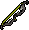

# Boosts & Requirements

You can check the boosts/requirements for a specific boss and by how much by using `/k`` `**`name:`**`[monster]`` `**`show_info:`**`true`. Some boosts don't currently appear so it is advised you crosscheck against this chart.

***

## Global Boosts

 **Elysian Spirit Shield:** Reduces food usage by 17.5% when equipped in the gear setup being used.&#x20;

&#x20; **Food:** Certain foods give boosts to the trip time during PvM. See more information [here](../getting-started/combat-skills.md#food-boosts).

 **Weapons:** Few items provide boosts when equipped and charged. See more information [here](../miscellaneous/charging-items.md#global-boosts).&#x20;

 B**lack Mask (i):** Gives a 16.67% boost while killing monsters on a slayer task.

Refer to the [Slayer Boosts](https://wiki.oldschool.gg/skills/slayer/slayer-boosts) page for more info on boosts that apply to generic slayer monsters.

***

## God Wars Dungeon



**Requirements**

 43 Prayer

 70 Agility

 Armadyl chestplate **OR**  Karil's leathertop

&#x20; Armadyl chainskirt **OR**  Karil's leatherskirt

**Boosts **<mark style="color:blue;">**(All boosts work from bank)**</mark>

10% for  Twisted bow **OR** 8% for  Zaryte crossbow **OR** 7% for  Bow of faerdhinen (c) **OR** 5% for  Armadyl crossbow

5% for Pegasian boots **OR** 3% for  Ranger boots

1% for .png) Masori body (f)

1% for .png) Masori chaps (f)

1% for .png) Masori mask (f)



**Requirements**

 43 Prayer

  70 Strength

\
\
**Boosts **<mark style="color:blue;">**(All boosts work from bank)**</mark>

10% for  Dragon warhammer **OR** 5% for .png>) Bandos godsword

3% for  Osmumten's fang

1% for  Lightbearer



**Requirements**

 40 Prayer

 70 Ranged

 Armadyl chestplate **OR**  Karil's leathertop

&#x20; Armadyl chainskirt **OR**  Karil's leatherskirt

**Boosts **<mark style="color:blue;">**(All boosts work from bank)**</mark>

10% for  Twisted bow **OR** 8% for  Zaryte crossbow **OR** 7% for  Bow of faerdhinen (c) **OR** 5% for  Armadyl crossbow

1% for .png) Masori body (f)

1% for .png) Masori chaps (f)

1% for .png) Masori mask (f)



**Requirements**

 43 Prayer

 70 Hitpoints

 Armadyl chestplate **OR**  Karil's leathertop

&#x20; Armadyl chainskirt **OR**  Karil's leatherskirt

**Boosts **<mark style="color:blue;">**(All boosts work from bank)**</mark>

**10**% for  Twisted bow **OR** 9% for  Arclight

10% for  Dragon warhammer **OR** 5% for .png>) Bandos godsword **OR** 3% for  Dragon claws



**Requirements**

  90 Defence

 90 Ranged

 74 Prayer

&#x20; [Frozen Key](nex.md)

 Zaryte crossbow **OR**  Armadyl crossbow **OR**  Dragon crossbow **OR**  Twisted bow&#x20;

1,000,000 Coins in bank (Covers death cost)

**Resource Used Per Trip (Regardless of Length/Kills)**

 600 Ammo equipped (50-60 used per kill before reductions)

.png) 8x Saradomin brew(4)

.png) 5x Super restore(4)

.png) 2x Ranging potion(4)

.png) 1x Sanfew serum(4)

**Boosts**

**-30%** chance of death for  Elysian spirit shield



## Dagannoth Kings



**Requirements**

 43 Prayer

 Guthan's helm

&#x20;  Guthan's platebody

&#x20;   Guthan's chainskirt

&#x20;Guthan's warspear

Armadyl chestplate **OR**  Karil's leathertop

&#x20; Armadyl chainskirt **OR**  Karil's leatherskirt

**Boosts **<mark style="color:blue;">**(All boosts work from bank)**</mark>

6% for  Twisted bow

4% for .png) Masori body (f) **OR** 2% for  Armadyl chestplate

4% for .png) Masori chaps (f) **OR** 2% for  Armadyl chainskirt



**Requirements**

 43 Prayer

 Guthan's helm

&#x20;  Guthan's platebody

&#x20;   Guthan's chainskirt

&#x20;Guthan's warspear

&#x20; Torva platebody **OR** .png>) Bandos chestplate **OR**  Torag's platebody

&#x20;  Torva platelegs **OR** .png>) Bandos tassets **OR**  Torag's platelegs

**Boosts **<mark style="color:blue;">**(All boosts work from bank)**</mark>

5% for  Harmonised nightmare staff **OR** 3% for  Iban's staff

5% for  Occult necklace



**Requirements**

 43 Prayer

 Guthan's helm

&#x20;  Guthan's platebody

&#x20;   Guthan's chainskirt

&#x20;Guthan's warspear

&#x20; .png>) Bandos chestplate **OR**  Torag's platebody

&#x20;.png>) Bandos tassets **OR**  Torag's platelegs

**Boosts **<mark style="color:blue;">**(All boosts work from bank)**</mark>

6% for  Dragon claws **OR** 4% for .png>) Saradomin godsword

2% for  Torva platebody **OR** .png>) Bandos chestplate

2% for  Torva platelegs **OR** .png>) Bandos tassets



## Callisto, Vet'ion, Venenatis (Inc. Singles Versions)


<mark style="color:red;">**There is always a chance to lose some of your gear when attempting these bosses!**</mark>




**Requirements**

 44 Prayer

 60 Hitpoints

&#x20; 60 Defence

 65 Range

 70 Magic

 115 Ranged attack

 71 Crush defence

 68 Magic defence

 Blighted ancient ice sacks **OR** Blood Death & Water runes **OR**  Stamina potion (4)

 Completion of Wilderness Medium diary <mark style="color:red;">**(Artio ONLY)**</mark>

**Boosts **<mark style="color:red;">**(All items must be equipped in WILDY setup for boost to apply)**</mark>

2.5% for  .png) Masori mask/Masori mask (f) **OR** 1% for  Armadyl helmet

3% for  Necklace of anguish **OR** 1% for  Amulet of fury **OR** 0.5% for  Amulet of glory

2% for  Ava's assembler **OR** 0.5% for  Ava's accumulator

3.5% for  .png) Masori body/Masori body (f) **OR** 0.5% for  Armadyl chestplate

3.5% for  .png) Masori chaps/Masori chaps (f) **OR** 1% for  Armadyl chainskirt **OR** 0.5% for  Black d'hide chaps

28% for  Webweaver bow **OR** 25% for  Craw's bow **OR** 6% for  Zaryte crossbow **OR** 1% for  Armadyl crossbow

3% for  Zaryte vambraces **OR** 0.5% for  Barrows gloves

1.5% for  Pegasian boots **OR** 1% for  Ranger boots **OR** 0.5% for any  God d'hide boots

3% for  Venator ring **OR** 1% for .png) Archers ring (i) **OR** 0.5% for  Brimstone ring



**Requirements**

 44 Prayer

 70 Hitpoints

 75 Attack

&#x20; 75 Strength

&#x20; 70 Defence

 70 Magic

 73 Crush attack

 80 Melee strength

 100 Stab defence

 99 Ranged defence

 30 Magic defence

 Bronze-Dragon knives **OR** any type of  Chinchompa

 Completion of Wilderness Medium diary <mark style="color:red;">**(Spindel ONLY)**</mark>

**Boosts **<mark style="color:red;">**(All items must be equipped in WILDY setup for boost to apply)**</mark>

5.5% for  Inquisitor's great helm OR 3% for  Torva full helm OR 2.5% for  Neitiznot faceguard

5.5% for  Amulet of torture OR 4% for  Amulet of strength OR 2.5% for  Amulet of fury

7.5% for  Infernal cape OR 4% for  Mythical cape OR 3% for  Fire cape

10% for  Inquisitor's hauberk OR 5% for  Torva platebody OR 3% for  Bandos chestplate

10% for  Inquisitor's plateskirt OR 5% for  Torva platelegs OR 3% for  Bandos tasset

52.5% for  Ursine chainmace **OR** 49.5% for  Viggora's chainmace **OR** 24.5% for  Inquisitor's mace **OR** 24% for  Abyssal bludgeon **OR** 1% for  Zamorakian hasta

17% for  Avernic defender **OR** 14.5% for  Dragon defender

7.5% for  Ferocious gloves **OR** 5% for  Barrows gloves

4% for  Primordial boots **OR** 2.5% for  Dragon boots

7.5% for  Ultor ring **OR** 5.5% for .png) Berserker ring (i) **OR** 5% for  Brimstone ring



**Requirements**

 44 Prayer

 70 Hitpoints

 75 Attack

&#x20; 75 Strength

&#x20; 70 Defence

 70 Magic

 73 Crush attack

 80 Melee strength

 110 Slash defence

 30 Magic defence

 Completion of Wilderness Medium diary <mark style="color:red;">**(Calvarion ONLY)**</mark>

**Boosts **<mark style="color:red;">**(All items must be equipped in WILDY setup for boost to apply)**</mark>

4% for  Inquisitor's great helm **OR** 2% for  Torva full helm **OR** 1.5% for  Neitiznot faceguard **OR** 1% for  Helm of neitiznot **OR** 0.5% for  Berserker helm

7.5% for  Infernal cape **OR** 6% for  Mythical cape **OR** 3% for  Fire cape

9% for  Inquisitor's hauberk **OR** 6% for  Torva platebody **OR** 3% for  Bandos chestplate

9% for  Inquisitor's plateskirt **OR** 6% for  Torva platelegs **OR** 3% for  Bandos tassets

49.5% for  Ursine chainmace **OR** 46% for  Viggora's chainmace **OR** 21.5% for  Inquisitor's mace **OR** 21% for  Abyssal bludgeon **OR** 2.5% for  Zamorakian hasta

16.5% for  Avernic defender **OR** 12.5% for  Dragon defender

9% for  Ferocious gloves **OR** 5% for  Barrows gloves

4% for  Primordial boots **OR** 2.5% for  Dragon boots

7.5% for  Ultor ring **OR** 5.5% for .png) Berserker ring (i) **OR** 5% for  Brimstone ring



## Other Wilderness Bosses



**Requirements**

 Karil's leathertop **OR**  Black d'hide body

 Karil's leatherskirt OR Black d'hide chaps

**Boosts **<mark style="color:blue;">**(All boosts work from bank)**</mark>

25% for  Webweaver bow **OR** 20% for  Craw's bow

5% for .png) Archers ring (i) **OR** 3% for  Archers ring

3% for  Barrows gloves



**Requirements**

None

**Boosts **<mark style="color:blue;">**(All boosts work from bank)**</mark>

25% for  Webweaver bow **OR** 20% for  Craw's bow

3% for  Karil's leathertop

3% for  Karil's leatherskirt



**Requirements**

None

**Boosts **<mark style="color:blue;">**(All boosts work from bank)**</mark>

10% for  Occult necklace



**Requirements**

None

**Boosts **<mark style="color:blue;">**(All boosts work from bank)**</mark>

10% for  Occult necklace

10% for  Harmonised nightmare staff



## Slayer Bosses



**Requirements**

 85 Slayer

**Boosts **<mark style="color:blue;">**(All boosts work from bank)**</mark>

12% for  Osmumten's fang **OR** 10% for  Arclight

10% for  Dragon warhammer **OR** 5% for .png>) Bandos godsword

10% for  POH Pool of rejuvenation or better



**Requirements**

 95 Slayer

.png)1 Antidote++ (4) per \~12 kills **OR** .png) 1 Anti-venom (4) per \~12 kills **OR** .png) 1 Anti-venom+ (4) per \~15 kills

&#x20;&#x20;

**Boosts **<mark style="color:blue;">**(All boosts work from bank)**</mark>

10% for  Twisted bow

3% for  Barrows gloves **OR** 6% for  Ferocious gloves

8% for  Saradomin godsword **OR** 10% for  Dragon claws

15% for  Dragon hunter lance (when training melee) **OR** 15% for  Dragon hunter crossbow (when training range)



**Requirements**

 91 Slayer

 43 Prayer

 Dharok's platebody **OR** .png>) Bandos chestplate **OR**  Torag's platebody

&#x20;    Dharok's platelegs **OR** .png>) Bandos tassets **OR**  Torag's platelegs

 Zamorakian spear **OR**  Zamorakian hasta

**Boosts **<mark style="color:blue;">**(All boosts work from bank)**</mark>

15% for  Inquisitor's mace **OR** 13% for  Abyssal bludgeon **OR** 11% for  Abyssal tentacle **OR** 10% for  Abyssal whip **OR** 8% for  Arclight

10% for  Spectral spirit shield

8% for  Inquisitor's hauberk **OR** 6% for  Torva platebody **OR** 5% for  Bandos chestplate

8% for  Inquisitor's plateskirt **OR** 6% for  Torva platelegs **OR** 5% for .png>) Bandos tassets



**Requirements**

 75 Slayer

 Brittle key (only needed once)

**Boosts **<mark style="color:blue;">**(All boosts work from bank except Venator bow)**</mark>

5% for  Venator bow <mark style="color:red;">**(must be equipped in range and**</mark> [<mark style="color:red;">**charged**</mark>](../miscellaneous/charging-items.md#venator-bow)<mark style="color:red;">**)**</mark>

5% for  Toxic blowpipe **OR** 3% for  Armadyl crossbow

10% for  Dragon claws **OR** 6% for  Saradomin godsword

10% for  Scythe of vitur **OR** 10% for .png) Scythe of vitur (uncharged)

1% for .png) Masori body (f)

1% for .png) Masori chaps (f)

1% for .png) Masori mask (f)



**Requirements**

 87 Slayer

 Trident of the seas **OR** .png) Trident of the seas (full) **OR** Uncharged trident of the seas **OR**  Uncharged toxic trident **OR** .png>) Trident of the swamp **OR** .png>) Sanguinesti staff **OR**  Harmonised nightmare staff

**Boosts **<mark style="color:blue;">**(All boosts work from bank)**</mark>

20% for .png>) Tumeken's shadow **OR** 15% for  Harmonised nightmare staff **OR** 12% for .png>) Sanguinesti staff **OR** 10% for .png>) Trident of the swamp **OR** 10% for  Uncharged Toxic trident **OR** 5% for  Uncharged Trident of the seas **OR** 8% for .png) Trident of the seas (full) **OR** 5% for  Trident of the seas

5% for .png>) Imbued heart/Saturated heart



**Requirements**

 93 Slayer

**Boosts **<mark style="color:blue;">**(All boosts work from bank)**</mark>

8% for  Harmonised nightmare staff **OR** 6% for .png>) Trident of the swamp **OR** 6% for  Uncharged Toxic trident **OR** 5% for  Trident of the seas **OR** 5% for  Uncharged Trident of the seas

8% for  Dragon claws **OR** 3% for  Dragon dagger

5% for  Occult necklace

5% for .png>) Imbued heart/Saturated heart

3% for  Ancestral robe top

2% for  Ancestral robe bottom



## Desert Treasure 2 Bosses (Inc. Awakened Version)



**Requirements**

 Torva platebody **OR**  Bandos chestplate

 Torva platelegs **OR**  Bandos tassets

**Boosts  **<mark style="color:red;">**(All items must be equipped in MELEE for boost to apply)**</mark>

3% for  Avernic defender

3% for  Ferocious gloves

3% for  Primordial boots

3% for  Torva full helm

3% for  Torva platebody

3% for  Torva platelegs

5% for  Bellator ring **OR** 5% for  Ultor ring

15% for  Scythe of vitur (must be [charged](../miscellaneous/charging-items.md#scythe-of-vitur))



**Requirements**

.png) Masori body **OR**  Armadyl chestplate

 Masori chaps **OR**  Armadyl chainskirt

**Boosts **<mark style="color:red;">**(All items must be equipped in RANGE for boost to apply)**</mark>

3% for  Twisted buckler

3% for  Zaryte vambraces

3% for  Pegasian boots

5% for  Zaryte crossbow

5% for  Masori mask (f) **OR** 4% for  Masori mask

5% for  Masori body (f) **OR** 4% for  Masori body

5% for  Masori chaps (f) **OR** 4% for  Masori chaps

5% for  Lightbearer **OR** 5% for  Venator ring



**Requirements**

 Ancestral robe top **OR**  Virtus robe top **OR**  Ahrim's robetop

 Ancestral robe bottom **OR**  Virtus robe bottom **OR**  Ahrim's robeskirt

 Tumeken's shadow **OR**  Sanguinesti staff (must be [charged](../miscellaneous/charging-items.md))

**Boosts **<mark style="color:red;">**(All items must be equipped in MAGE for boost to apply)**</mark>

5% for  Venator bow <mark style="color:red;">**(must be equipped in range and**</mark> [<mark style="color:red;">**charged**</mark>](../miscellaneous/charging-items.md#venator-bow)<mark style="color:red;">**)**</mark>

3% for  Elidinis' ward (f)

3% for  Tormented bracelet

3% for  Eternal boots

5% for  Tumeken's shadow

5% for  Ancestral hat **OR** 3% for  Virtus mask

5% for  Ancestral robe top **OR** 3% for  Virtus robe top

5% for  Ancestral robe bottom **OR** 3% for Virtus robe bottom

5% for  Lightbearer **OR** 5% for  Magus ring



**Requirements**

 Torva platebody **OR**  Bandos chestplate

 Torva platelegs **OR**  Bandos tassets

**Boosts  **<mark style="color:red;">**(All items must be equipped in MELEE for boost to apply)**</mark>

3% for  Avernic defender

3% for  Ferocious gloves

3% for  Primordial boots

3% for  Torva full helm

3% for  Torva platebody

3% for  Torva platelegs

5% for  Bellator ring **OR** 5% for  Ultor ring

15% for  Scythe of vitur (must be [charged](../miscellaneous/charging-items.md#scythe-of-vitur))



## Sporadic Bosses



**Requirements**

 1 Mossy Key (consumed every kill)

**Boosts**

None



**Requirements**

 1 Giant Key (consumed every kill)

**Boosts**

None



**Requirements**

 1 Dark Totem (consumed every kill)

**Boosts **<mark style="color:blue;">**(All boosts work from bank)**</mark>

50% for  Arclight&#x20;



## Other Bosses



**Requirements**

 43 Prayer

**Boosts **<mark style="color:blue;">**(All boosts work from bank)**</mark>

2% for  Barrows gloves

5% for  Iban's staff

7% for .png) Strange old lockpick

10% for  POH Pool of rejuvenation or better



**Requirements**

 43 Prayer

 Zamorakian spear

**Boosts **<mark style="color:blue;">**(All boosts work from bank)**</mark>

50% for  POH Pool of rejuvenation or better

10% for  Dragon warhammer

5% for .png>) Bandos godsword



**Requirements**

 43 Prayer

 10 Melee strength

 Verac's flail

 Verac's plateskirt

 Armadyl chestplate **OR**  Karil's leathertop  Black d'hide body

&#x20; Armadyl chainskirt **OR**  Karil's leatherskirt   Black d'hide chaps

**Boosts **<mark style="color:blue;">**(All boosts work from bank)**</mark>

5% for  Elder maul

5% for  Keris partisan of breaching

10% for  Dragon warhammer

10% for  POH Pool of rejuvenation or better



**Requirements**

 Anti-dragon shield

 Twisted bow **OR**  Dragon hunter crossbow **OR**  Armadyl crossbow **OR**  Rune crossbow

 Karil's leathertop **OR**  Black d'hide body **OR** .png) Black d'hide body (g) **OR** .png) Black d'hide body (t)

 Karil's leatherskirt **OR** Black d'hide Chaps **OR** .png) Black d'hide chaps (g) **OR** .png) Black d'hide chaps (t)

**Boosts **<mark style="color:blue;">**(All boosts work from bank)**</mark>

10% for  Twisted bow **OR** 6% for  Armadyl crossbow\
15% for  Dragon hunter lance (when training melee) **OR** 15% for  Dragon hunter crossbow (when training range)





**Requirements**

 43 Prayer

.png) 1 Prayer potion per 10 kills

**Boosts **<mark style="color:blue;">**(All boosts work from bank)**</mark>

5% for  Barrows gloves

10% for  Twisted bow **OR** 7% .png) for Berserker ring (i) **OR** 5% for  Berserker ring&#x20;



**Requirements**

.png>) 30 Quest points

 Rune crossbow **OR**  Karil's crossbow **OR**  Armadyl crossbow **OR**  Toxic blowpipe **OR** .png) Toxic blowpipe (empty)

**Boosts  **<mark style="color:blue;">**(All boosts work from bank)**</mark>

15% for  Toxic blowpipe **OR** 8% for  Armadyl crossbow

5% for .png) Ring of the gods (i) **OR** 3% for  Ring of the gods

2% for .png) Shayzien helm (5)



**Requirements**

Food

Minimum 80 Crush Attack

**Boosts**\
See [The Nightmare](https://wiki.oldschool.gg/minigames/nightmare-of-ashihama) for boosts and more information.



**Requirements **<mark style="color:red;">**(Must be equipped in MAGIC setup and charged)**</mark>

 Tumeken's shadow **OR**  Sanguinesti staff **OR**  Trident of the swamp

**Boosts **<mark style="color:red;">**(Must be equipped in respective setup)**</mark>

4% for  Saturated heart **OR** 2% for  Imbued heart <mark style="color:blue;">**(Works from bank)**</mark>

10% for  Twisted bow

10% for  Dragon arrows **OR** 6% for  Amethyst arrows

6% for .png) Masori body (f) **OR** 3% for  Masori body

6% for .png) Masori chaps (f) **OR** 3% for  Masori chaps

11% for .png>) Tumeken's shadow 6% for  Sanguinesti staff

6% for  Ancestral robe top

6% for  Ancestral robe bottom

3% for  Ava's assembler

3% for  Zaryte vambraces

3% for  Pegasian boots

3% for  Eternal boots





**Requirements**

.png>) 205 Quest points

.png) 5 Stamina potion (4) (consumed every kill)

\_5.png) 100 Ruby dragon bolts (e) <mark style="color:red;">**(must be equipped in RANGE setup)**</mark>

**Boosts**

None



**Requirements**

 43 Prayer

 65 Crush attack

 73 Stab defence

 177 Ranged defence

**Boosts **<mark style="color:blue;">**(All boosts work from bank)**</mark>

5% for  Dragon claws

15% for  Scythe of vitur **OR** 12% for  Inquisitor's mace **OR** 8% for  Abyssal bludgeon

3% for  Karil's leathertop

2% for  Karil's leatherskirt



**Requirements**

 43 Prayer

**Boosts**

None



**Requirements**

 43 Prayer

.png>) 205 Quest points

 Armadyl chestplate

&#x20; Armadyl chainskirt

**Boosts **<mark style="color:blue;">**(All boosts work from bank)**</mark>

1% for  Lightbearer

15% for  Dragon hunter lance **OR** 15% for  Dragon hunter crossbow

18% for  Zaryte crossbow **OR** 13% for  Dragon warhammer **OR** 13% for .png>) Bandos godsword **OR** 8% for  Dragon claws

20% for .png) Salve amulet (ei) **OR** 16% for .png) Salve amulet (i)



**Requirements**

 43 Prayer

.png>) 75 Quest points

 50 Magic attack

 47 Ranged attack

**Boosts **<mark style="color:blue;">**(All boosts work from bank)**</mark>

5% for  Twisted bow **OR** 4% for  Toxic blowpipe **OR** 3% for  Bow of faerdhinen (c) **OR** 2% for  Magic shortbow

5% for  Harmonised nightmare staff **OR** 4% for .png>) Sanguinesti staff **OR** 3% for  Trident of the swamp **OR** 2% for  Trident of the seas (full) **OR** 1% for  Iban's staff

4% for  Pegasian boots **OR** 2% for  Ranger boots

3% for  Barrows gloves

3% for .png>) Imbued heart **OR** Saturated heart

2% for  Ancestral hat

2% for  Ancestral robe top

2% for  Ancestral robe bottom




(Please drop a message in #wiki if you find any monsters not listed on the [Slayer Boosts](https://wiki.oldschool.gg/skills/slayer/slayer-boosts) page or here. Include a screenshot.)

