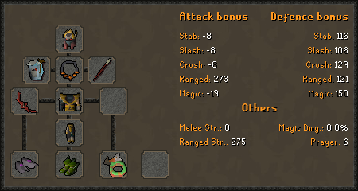

# Fight Caves

## Overview

You can challenge the Fight Caves and TzTok-Jad to receive a fire cape, tokkul, and the TzRek-Jad pet. The number of total attempts you have made will largely determine your [chances of killing Jad](./#survival-chance) when he is reached, while your [equipped range gear](./#best-in-slot-range-gear) and a couple of specific items will provide a [boost](./#boosts) to the overall time it takes to complete.

Tokkul gained from completions can be spent at the [Tokkul shop](https://wiki.oldschool.gg/bosses/fight-caves/tokkul-shop).\
\
The fight caves uses **4-dose potions only**. Use the following commands to decant all your potions into 4-dose. Should you fail before the final wave, some of your potions will be refunded.

* `/activities decant`` `**`potion_name:`**`Prayer potion`` `**`dose:`**` ``4`
* `/activities decant`` `**`potion_name:`**`Super restore`` `**`dose:`**`4`
* `/activities decant`` `**`potion_name:`**`Saradomin brew`` `**`dose:`**`4`

***

## Commands

To start a trip into the Fight caves, use

* `/activities fight_caves`

To gamble a Fire cape at a chance for the TzRek-Jad pet, use:

* `/gamble cape`` `**`type:`**` ``fire`

To sacrifice a Fire cape for the Inferno, use:

* `/sacrifice`` `**`items:`**`1 fire cape`

***

## Requirements

 +160 range bonus equipped to your range gear setup.

 43 prayer&#x20;

10x .png) Prayer Potion (4), 4x .png) Super Restore (4), 6x .png) Saradomin Brew (4) **per attempt**.

***

## Boosts

 A Saradomin godsword <mark style="color:red;">**equipped**</mark> <mark style="color:red;">**in any setup**</mark> gives +4% survival chance before Jad.

 Having a Twisted Bow <mark style="color:blue;">**in your bank**</mark> gives a 15% boost to time.

 Completing Fight caves while on a Jad slayer task gives a 15% boost to time.

 Completion of the Inferno will grant a boost to completion time

***

## Best in Slot Range Gear

The following gear will provide the highest gear bonus while fighting Jad (maximum of 58%). The bonus is based off your range attack bonus, not ranged strength. Your boost is roughly calculated at 1% for every 5.25 range attack bonus. To equip your best range attack gear, use the following:

* `/gear equip`` `**`gear_setup:`**`Range`` `**`auto:`**`attack_ranged`

<figure><figcaption></figcaption></figure>

***

## Survival Chance

Your survival chance during the fightcaves is calculated based on your number of attempts and whether or not you have a Saradomin godsword equipped. During Jad, your survival chance can never be more than 95%.

If you have any amount of Inferno KC, your survival chance is automatically at it's highest.

<table data-header-hidden><thead><tr><th width="158"></th><th></th><th></th></tr></thead><tbody><tr><td><strong>No. of Attempts</strong></td><td><strong>Survival (Without SGS)</strong></td><td><strong>Survival (With SGS)</strong></td></tr><tr><td>0</td><td>0.9%</td><td>0.9%</td></tr><tr><td>1</td><td>0.9%</td><td>0.9%</td></tr><tr><td>2</td><td>23.4%</td><td>24.4%</td></tr><tr><td>3</td><td>37.7%</td><td>39.4%</td></tr><tr><td>4</td><td>48.9%</td><td>51%</td></tr><tr><td>5</td><td>57%</td><td>59.4%</td></tr><tr><td>6</td><td>63.7%</td><td>66.3%</td></tr><tr><td>7</td><td>68.4%</td><td>71.3%</td></tr><tr><td>8</td><td>73.2%</td><td>76.2%</td></tr><tr><td>9</td><td>77.9%</td><td>81.2%</td></tr><tr><td>10</td><td>81.7%</td><td>85.1%</td></tr><tr><td>11</td><td>84.6%</td><td>88.1%</td></tr><tr><td>12</td><td>87.4%</td><td>91.1%</td></tr><tr><td>13+</td><td>90.3%</td><td>94.1%</td></tr></tbody></table>
