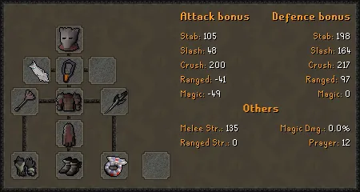

# The Nightmare

## Overview

You can kill The Nightmare to receive the inquisitor's armour set, the inquisitor's mace, the nightmare staff, and the 3 orbs that can be combined with the nightmare staff (harmonised orb, eldritch orb, & volatile orb).

To start a solo Nightmare trip, use:

* `/k`` `**`name:`**` ``Solo nightmare`

To start a mass Nightmare trip, use:

* `/k`` `**`name:`**` ``Mass nightmare`

While killing The Nightmare, your minion has a chance to die. This chance is affected by your kc and gear. Your chance of death has a maximum of 90%, and a minimum of 2%.

***

## Boosts and Penalties

There are certain boosts and penalties given based on specific stats and gear. They are as follows:

### Total KC

* **0-9** - 15% speed penalty - In masses, having less than 10kc gives a 20% damage reduction.
* **10-24** - 5% speed penalty
* **25-49** - 2% speed penalty
* **50-99** - 2% speed _increase_
* **100+** - 4% speed _increase_

### Crush Attack Stat

* Less than 65 crush attack - 5% speed penalty
  * Essentially, any weapon weaker then a Zamorakian hasta will incur this penalty.

<mark style="color:red;">**NOTE:**</mark> In masses, your damage output will be halved if you have lower than 65 crush attack.

<mark style="color:red;">**NOTE:**</mark> In masses, your damage output will be doubled if using an inquisitors mace.

### Melee Strength Bonus

* Less than 40% of maximum strength bonus (<82) - 6% speed penalty
* Between 40-49% of maximum strength bonus (83-102) - 3% speed penalty
* Between 50-59% of maximum strength bonus (103-123) - 2% speed penalty

The maximum melee strength bonus is 204. Anything above 123 will not incur these penalties.

### Inquisitors Items

* **Solos**
  * 2% boost per piece (10% boost if all 4 items are equipped)
* **Masses**
  * 0.5% boost per piece (3% boost if all 4 items are equipped)

<mark style="color:red;">**NOTE:**</mark> Having an Elysian Spirit Shield equipped in your melee setup will also reduce food usage by 17.5%. However, this is outweighed by the food reduction of using an elder maul or a dragon defender.

***

## Gear Setups

<figure><figcaption>
BIS setup with full inquisitor's.
</figcaption></figure>
