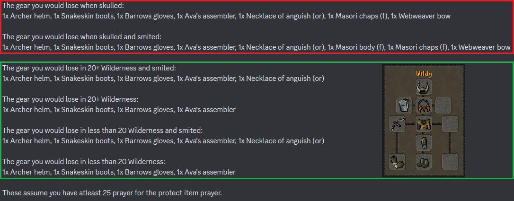

# Wilderness

With the release of the updated wildy bosses, it is more dangerous than ever to hunt uniques in the wilderness! You are now risking more for more reward! This page details the info regarding mechanics and items unique to the wilderness. For info on boosts and requirements on wildy bosses, please visit the [respective page](../boosts-and-requirements.md#callisto-vetion-venenatis-inc.-singles-versions).

## Things To Know Before Starting


**The following info is specific to wilderness bosses.** [**Revenants**](revenants.md) **have different death and PKer mechanics. Please read that page for more info.**



<mark style="color:red;">**Killing Callisto, Vet'ion or Venenatis (and their weaker variants) can risk some of your gear in the wildy setup. Do NOT equip items you're not willing to lose. See**</mark> [<mark style="color:blue;">**Wildy Gear**</mark>](./#wildy-gear)



<mark style="color:green;">**When doing these wildy bosses, you will never be skulled. This means, you will always keep your best 4 items, unless you are smited, in which case you will still keep 3 items.**</mark>


### PK & Death Chance 

Your death chance is based on a number of factors. Firstly, you need to encounter a PKer for a death to be possible. There are 3 time periods when doing wildy bosses that will influence the chances of you running into a PKer. The below percentages represent how likely you will encounter a PKer _**for every minute of your trip**_. These time periods are random and change every \~2 hours.

<table data-full-width="false"><thead><tr><th></th><th align="center"></th><th align="center"></th></tr></thead><tbody><tr><td><strong>PK Peak Times</strong></td><td align="center">
<strong>Chance of PKer at</strong> 

<strong>Callisto, Vet'ion, Venenatis</strong>
</td><td align="center">
<strong>Chance of PKer at</strong> 

<strong>Artio, Calvarion, Spindel</strong>
</td></tr><tr><td>Low period</td><td align="center">1.52%</td><td align="center">2.85%</td></tr><tr><td>Medium period</td><td align="center">7.59%</td><td align="center">14.29%</td></tr><tr><td>High period<mark style="color:red;"><strong>*</strong></mark></td><td align="center">18.98%%</td><td align="center">35.71%</td></tr></tbody></table>

<mark style="color:red;">**\***</mark> _<mark style="color:red;">**- You will be asked for confirmation when attempting to send a trip during a high PK period.**</mark>_

If you happen to encounter a PKer, you will then "fight" your opponent. When this happens, you will lose some kc during your trip and therefore, lose some potential loot also. There are a few things that will affect whether you get PKed or survive. There is a 10% base chance of your minion getting PKed, however, the following things will affect this percentage:

* Your gear (specifically, your defensive stats. All 3 combat styles play a part)
* Anti-PK supplies (read [Smite chance](./#smite-chance) below)
* Having 43 Prayer for overheads (higher Prayer levels will NOT grant better percentage)
* Your experience in killing wilderness bosses
* Whether the boss is located in a multi-combat area

***

### Smite Chance 


These supplies are different from [revenants](revenants.md). Please check there for more info.


These supplies will heavily influence your chances of being smited or not. You also need 25 Prayer for Protect item. With supplies, the base chance of being smited when you are PKed is 1/300. However, without them, it's a 1/20 chance. These supplies consist of:

&#x20;.png) Saradomin brew(4) - 1 for every 4 minutes of your trip

&#x20;.png) Super restore(4) - 1 for every 8 minutes of your trip

 Karambwan - 1 for every 4 minutes of your trip

***

### Wildy Gear 

While killing wilderness bosses, your wildy gear setup is at risk. However, because you are **NOT** skulled when killing them, you will almost always keep your best 4 items. The only time you lose your +1, is if you get [smited](./#smite-chance).

You can see what items you will keep/lose through the following command:

* `/gear view`` `**`setup:`**` ``Lost On Wildy Death`

<figure><figcaption></figcaption></figure>

In the above image, you can ignore the things listed in the red box because you are not skulled when doing wilderness bosses. The green box notifies you of the items kept and lost upon a death.  The 3 items kept on death are Webweaver bow, Masori body (f), and Masori chaps (f). The +1 item is the Necklace of Anguish (or). Everything else will always be lost when Pked. This means you can comfortably equip your 3 best boosting items for wildy bosses without the worry of losing them.

However, untradeable items or items that have a 0 value will usually not be kept as one of your 3-4 items kept on death. For example, the DT2 rings in their current state are using the incorrect item ID, and therefore giving the rings a 0 value. This means that something with a low value but still a higher value than the ring, may be kept over the ring upon a death.

***

## Voidwaker 

All 3 pieces can be obtained from their respective bosses and combined to create the voidwaker. Each piece is dropped by the stronger variants at 1/360, or 1/912 from the weaker variants. The voidwaker currently gives no boosts to any bosses.

* `/create`` `**`item:`**`voidwaker`

## Upgraded Rev Weapons   

The upgrades to rev weapons can be obtained and attached to create the stronger variant of each.  The upgraded rev weapons provide a slightly better boost over their regular counterparts. It costs 7000 ether to charge a wildy weapon, which can also be reverted to receive the base weapon and ether back.  Each piece is dropped by the stronger variants at 1/196, or 1/618 from the weaker variants.

* `/create`` `**`item:`**`Webweaver bow`
* `/create`` `**`item:`**`Accursed sceptre`
* `/create`` `**`item:`**`Ursine chainmace`
