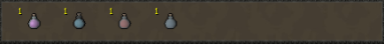
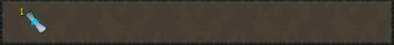
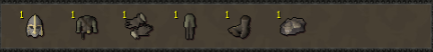

# Grandmaster Clues

### Prerequisites&#x20;

* 250 QP
* Level 90 in all skills
* 'Actual clues completed' - You have the clue drop on CL, you have run trips of the clues, and you have opened the caskets as followed:
  * Easy - 300
  * Medium - 250
  * Hard - 200
  * Elite - 150
  * Master - 100

Master clue scrolls can be created by Watson by using the `/create item:Master clue quantity:[#]` command if you have the required lower-tier clue scrolls in your bank.

### Boosts

* [Clue global boosts, information can be found on the OSB Wiki page](https://wiki.oldschool.gg/miscellaneous/clue-scrolls/boosts#global-boosts)
* [Clue Hunter Outfit](equippables/#clue-hunter-outfit) - 2x speed&#x20;
* [Zippy](https://bso-wiki.oldschool.gg/custom-items/pets#resource-gathering-and-loot-effecting-pets) - 1/15 chance to double, chance of Beginner to Master caskets, UMB and TMB (stacks with global double)
* Clue score - up to 10% at roughly 60 clues completed

### Obtaining

Grandmaster Clues can be received from a wide range of content. The rates are not included here because they change often and vary greatly between sources. A list of common sources is as follows:

[Kalphite King](https://bso-wiki.oldschool.gg/bosses/kalphite-king), [Vasa Magus](../bso-custom-killables/bosses/vasa-magus.md), [Sea Kraken](https://bso-wiki.oldschool.gg/bosses/sea-kraken), [Ignecarus](https://bso-wiki.oldschool.gg/bosses/ignecarus), [Nex](https://bso-wiki.oldschool.gg/bosses/nex), [Malygos](https://bso-wiki.oldschool.gg/bosses/malygos), [QBD](../bso-custom-killables/demi-bosses/queen-black-dragon.md#rewards), [Elder Birdhouses](../skills/hunter.md), Fishing, Woodcutting, Master Clue Caskets, and [Item Contracts](https://bso-wiki.oldschool.gg/custom-items/item-contracts).

### General Loot Table

The general loot table from Grandmaster Caskets consists of:

* Small amounts of teak, mahogany, yew, magic and elder logs
* Varying amounts and types of runes
* Rune and dragon equipment
* Mysterious Seeds
* Air, Earth, Fire, and Water orbs
* Normal, Air, Earth, Fire, Water, Steam and Lava battlestaves
* Tradeable, Untradeable, Equippable, Pet and Holiday Mystery boxes
* Barrows equipment
* Tiny, Small, Average, Large Huge Lamps
* Clue Scrolls (Beginner to Master)
* Random Clue Scroll Loot (Hard to Master)
* Super Restores and Saradomin Brew

### Unique Loot Table

The Grandmaster loot system operates on rolls, of which there are 5-11 for each casket opened. Because of this, the drop rate varies based on the rolls you receive, so it will be represented as X.

* Malygos and Ignecarus Masks (x/50)

* [Deathtouched Dart](https://bso-wiki.oldschool.gg/custom-items/misc) (x/4000)

* [Dyes](https://bso-wiki.oldschool.gg/custom-items/dyes?q=dyes) (x/10000)

* [First Age Equipment](https://bso-wiki.oldschool.gg/custom-items/equippables#first-age) (x/130000)

* [Dwarven Blessing](https://bso-wiki.oldschool.gg/custom-items/equippables#dwarven-equipment) (x/10000)

* [Clue Hunter](https://bso-wiki.oldschool.gg/custom-items/equippables#clue-hunter-outfit) (x/2500)

* [Blabberbeak](pets.md#meme-pets-and-no-perk-pets) (x/20000)
* Ring of luck (x/8000)

