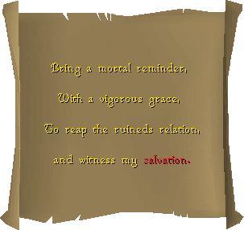
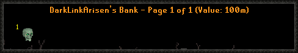

# Crack the Clue 2022

### Clues

Only two clues were provided for the event, being the following:

The second clue reads as:\
\
"As night comes, Remember a betrayal, A haunting tale"

### Steps and Rewards

There are only two steps to solving the clue, with very low requirements.

1. Complete a revenants trip while skulled
2. Equip a Viggora's Chainmace and harvest Hespori (without doing any trips in between)

Unlike the Crack the Clue that rewarded a clue hunter set, this clue only gives an item called the Tormented Skull as a reward. (This is outside of the reward provided to the first person who solved the clue)

