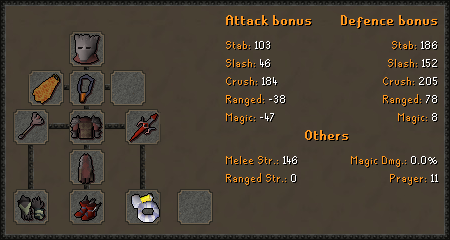
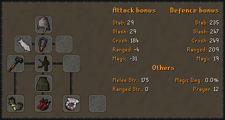
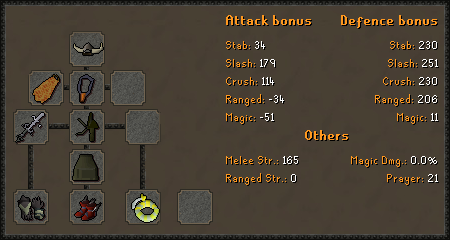
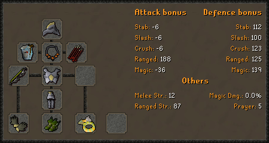
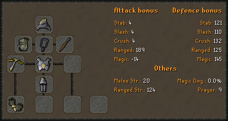
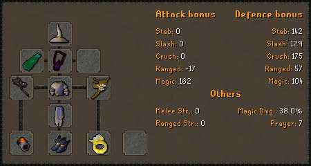
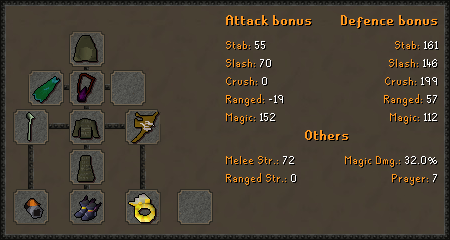

# Gear Setups

## Overview

Your gear score \(shown by doing +raid gear\) is calculated by comparing your current gear's stats to a reference setup. Therefore, in order to reach a 100% gear score, you must have all of the relevant stats equal or exceed the stats of these reference setups. Depending on the setup, certain stats are ignored. \(e.g range attack in your melee setup\)  
  
Currently, each setup looks at **all** of your strength bonuses \(melee, mage dmg, & range\), however this is subject to change.  
  
This list shows the reference setups, as well as some alternative setups that can be used instead.

## Melee

Your melee gear score is based on your highest melee attack bonus, \(slash attack, crush attack, stab attack\) your strength bonuses \(melee, mage dmg, & range\), your defensive stats, and your prayer bonus.  
If you are below 50% of the reference strength bonus, \(73\) your gear score is halved.

### Reference Setup

### Alternative Setups

Barrows gloves and primordial boots can be replaced with just ferocious gloves.  
The elder maul is required in order to reach 100% gear score without inquisitor's armor.

This setup will give a gear score of 99.6%, as it has slightly less slash attack compared to the reference setup's crush attack.

## Range

Your range gear score is based on your range attack bonus, your defensive bonuses, your strength bonuses \(melee, mage dmg, & range\), and prayer bonus.  
If you are below 50% of the reference gear's range strength \(43.5\), your gear score is halved.

### Reference Setup

### Alternative Setup

Although the twisted bow is equipped in the reference setup, you are not actually required to equip it in order for it to apply a boost to your overall score. Due to this, and due to the twisted bow's mediocre offensive stats, it is trivial to create a setup that will give 100% gear score. This setup is effectively the bare minimum to reach 100%.

## Mage

Your mage gear score is based on your magic attack, your defensive bonuses, your strength bonuses \(melee, mage dmg, & range\), and prayer bonus.  
If you are below 50% of the reference gear's magic damage, \(19%\) your gear score is halved.

### Reference Setup

Due to this setup having the maximum magic damage, as well as close to the maximum magic attack, it is difficult to find alternative setups that would still give 100% gear score, and impossible to obtain 100% gear score without ancestral robes.  
  
The harmonised nightmare staff can be replaced with a kodai wand, a staff of the dead, or any other nightmare staff. \(kodai &gt; SOTD &gt; NM staves\) While these replacements make no difference if you are in max gear, they can increase your score if you lack some of the other items, like ancestral.

### Alternative Setup

This setup requires no rewards from the Chambers of Xeric, and provides a gear score of 96.8%

