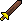

# Combat Achievements


<mark style="color:red;">**There are currently some issues with certain/most CAs. An update is coming but ETA is unknown. This message will be removed when a fix is in place.**</mark>


## Getting Started

You can complete almost all the same combat achievements in the bot, as the real game. However, the method in order to obtain some achievements are different to the real game as the bot simply cannot reflect the nature of the all tasks. The CA system is point based, the same as in-game.

Some tasks (usually kc-based tasks) are simply claimed retroactively by using:

* `/ca claim`

To view all your complete and incomplete CA tasks, or filter by monster, use:

* `/ca view`` `**`type:`**`all`
* `/ca view`` `**`type:`**`complete`
* `/ca view`` `**`name:`**`Barrows`` `**`type:`**`incomplete`

***

## Point System

Like osrs, certain tiers are unlocked after attaining a certain number of points. They are as follows:

|             |                      |                                |
| ----------- | :------------------: | :----------------------------: |
| **Tier**    | **Available Points** | **Total Points For Next Tier** |
| Easy        |          33          |               33               |
| Medium      |          80          |               113              |
| Hard        |          189         |               302              |
| Elite       |          504         |               806              |
| Master      |          645         |              1,451             |
| Grandmaster |          552         |              2,003             |

## Combat Tasks

While there are 556 CA tasks in osrs, the bot contains a few less at 483. Below is a list of all possible combat tasks to complete in the bot. To view the full list of OSRS CA tasks in one page, please visit the [OSRS CA wiki page](https://oldschool.runescape.wiki/w/Combat\_Achievements/All\_tasks).


<mark style="color:blue;">**If the 'How To Unlock' description does not contain a 1/X, it means that the chance is 1/1.**</mark>



<mark style="color:red;">**Some tasks are currently broken, meaning you can obtain them differently to the intended method. They may be fixed in the future! These tasks are marked in red.**</mark>





<mark style="color:green;">**Easy tasks are worth 1 point each. There are a total of 33 easy tasks.**</mark>


|                        |                               |                                                                                                                       |
| ---------------------- | ----------------------------- | --------------------------------------------------------------------------------------------------------------------- |
| **Monster**            | **Task Name**                 | **How To Unlock**                                                                                                     |
| Aberrant Spectre       | Noxious Foe                   | Kill 1 Aberrant Spectre                                                                                               |
| Barrows                | Barrows Novice                | Complete 10 Barrows chests                                                                                            |
| Barrows                | Defence? What Defence?        | Complete Barrows while your combat style is set to magic                                                              |
| Black Dragon           | Big, Black and Fiery          | Kill 1 Black dragon or KBD                                                                                            |
| Bloodveld              | The Demonic Punching Bag      | Kill 1 Bloodveld                                                                                                      |
| Bryophyta              | Preparation Is Key            | 1/15 chance to be given per kill                                                                                      |
| Bryophyta              | Fighting as Intended II       | Kill Bryophyta with ONLY f2p gear equipped in your currently used combat style                                        |
| Bryophyta              | Bryophyta Novice              | Kill 1 Bryophyta                                                                                                      |
| Bryophyta              | A Slow Death                  | 1/5 chance to be given per kill                                                                                       |
| Bryophyta              | Protection from Moss          | Kill 1 Bryophyta                                                                                                      |
| Deranged Archaeologist | Deranged Archaeologist Novice | Kill 10 Deranged Archaeologist                                                                                        |
| Fire Giant             | The Walking Volcano           | Kill 1 Fire Giant                                                                                                     |
| Giant Mole             | Giant Mole Novice             | Kill 10 Giant Mole                                                                                                    |
| Greater Demon          | A Greater Foe                 | Kill 1 Greater Demon                                                                                                  |
| Greater Demon          | Not So Great After All        | Kill 1 Greater Demon with a Silverlight, Darklight, or Arclight equipped                                              |
| Hellhound              | A Demon's Best Friend         | Kill 1 Hellhound                                                                                                      |
| King Black Dragon      | King Black Dragon Novice      | Kill 10 KBD                                                                                                           |
| Lizardman Shaman       | A Scaley Encounter            | Kill 1 Lizardman Shaman                                                                                               |
| Lizardman Shaman       | Shayzien Protector            | 1/15 chance to be given per kill                                                                                      |
| Other                  | Into the Den of Giants        | Kill 1 Hill Giant, 1 Moss Giant, and 1 Fire Giant                                                                     |
| Obor                   | Obor Novice                   | Kill 1 Obor                                                                                                           |
| Obor                   | Fighting as Intended          | Kill Obor with ONLY f2p gear equipped in your currently used combat style                                             |
| Obor                   | Sleeping Giant                | 1/10 chance to be given per kill                                                                                      |
| Sarachnis              | Sarachnis Novice              | Kill 10 Sarachnis                                                                                                     |
| Scurrius               | Sit Rat                       | Kill Scurrius with any Bone weapon equipped                                                                           |
| Scurrius               | Scurrius Novice               | Kill 1 Scurrius                                                                                                       |
| Tempoross              | Master of Buckets             | 1/5 chance to be given per kill                                                                                       |
| Tempoross              | Calm Before the Storm         | 1/3 chance to be given per kill                                                                                       |
| Tempoross              | Fire in the Hole!             | 1/3 chance to be given per kill                                                                                       |
| Tempoross              | Tempoross Novice              | Kill 5 Tempoross                                                                                                      |
| Wintertodt             | Handyman                      | Kill 1 Wintertodt                                                                                                     |
| Wintertodt             | Cosy                          | Kill 1 Wintertodt while having 4 pieces of [warm clothing](../skills/firemaking/wintertodt.md#warm-clothing) equipped |
| Wintertodt             | Mummy!                        | 1/15 chance to be given per kill                                                                                      |
| Wintertodt             | Wintertodt Novice             | Kill 5 Wintertodt                                                                                                     |
| Wyrm                   | A Slithery Encounter          | Kill 1 Wyrm                                                                                                           |




<mark style="color:green;">**Medium tasks are worth 2 points each. There are a total of 40 medium tasks.**</mark>


|                        |                                                      |                                                                                                  |
| ---------------------- | ---------------------------------------------------- | ------------------------------------------------------------------------------------------------ |
| **Monster**            | **Task Name**                                        | **How To Unlock**                                                                                |
| Barrows                | Pray for Success                                     | 1/10 chance to be given per chest                                                                |
| Barrows                | Barrows Champion                                     | Complete 25 Barrows chests                                                                       |
| Barrows                | Can't Touch Me                                       | 1/50 chance to be given per chest                                                                |
| Brutal Black Dragon    | Brutal, Big, Black and Firey                         | Kill 1 Brutal Black Dragon                                                                       |
| Bryophyta              | Bryophyta Champion                                   | Kill 5 Bryophyta                                                                                 |
| Bryophyta              | Quick Cutter                                         | 1/15 chance to be given per kill                                                                 |
| Chaos Fanatic          | Chaos Fanatic Champion                               | Kill 10 Chaos Fanatic                                                                            |
| Chaos Fanatic          | Sorry, What Was That?                                | 1/20 chance to be given per kill                                                                 |
| Crazy Archaeologist    | I'd Rather Not Learn                                 | 1/20 chance to be given per kill                                                                 |
| Crazy Archaeologist    | Crazy Archaeologist Champion                         | Kill 10 Crazy Archaeologist                                                                      |
| Crazy Archaeologist    | Mage of the Ruins                                    | Kill CA while your combat style is set to magic                                                  |
| Dagannoth Prime        | Dagannoth Prime Champion                             | Kill 10 Dagannoth Prime                                                                          |
| Dagannoth Rex          | Dagannoth Rex Champion                               | Kill 10 Dagannoth Rex                                                                            |
| Dagannoth Rex          | A Frozen King                                        | 1/15 chance to be given per kill                                                                 |
| Dagannoth Supreme      | Dagannoth Supreme Champion                           | Kill 10 Dagannoth Supreme                                                                        |
| Deranged Archaeologist | I'd Rather Be Illiterate                             | 1/15 chance to be given per kill                                                                 |
| Deranged Archaeologist | Mage of the Swamp                                    | Kill DA while your combat style is set to magic                                                  |
| Deranged Archaeologist | Deranged Archaeologist Champion                      | Kill 25 Deranged Archaeologist                                                                   |
| Gargoyle               | A Smashing Time                                      | Kill 1 Gargoyle                                                                                  |
| Giant Mole             | <mark style="color:red;">Giant Mole Champion</mark>  | <mark style="color:red;">Kill 1 Giant Mole</mark>                                                |
| Giant Mole             | Avoiding Those Little Arms                           | 1/35 chance to be given per kill                                                                 |
| King Black Dragon      | King Black Dragon Champion                           | Kill 25 KBD                                                                                      |
| King Black Dragon      | Claw Clipper                                         | Kill 1 KBD                                                                                       |
| King Black Dragon      | Antifire Protection                                  | Kill 1 KBD                                                                                       |
| King Black Dragon      | Hide Penetration                                     | Kill KBD while your combat style is set to melee and your weapon has a stab bonus of more than 0 |
| Kurask                 | Master of Broad Weaponry                             | Kill 1 Kurask                                                                                    |
| Obor                   | Back to the Wall                                     | 1/15 chance to be given per kill                                                                 |
| Obor                   | Squashing the Giant                                  | 1/15 chance to be given per kill                                                                 |
| Obor                   | Obor Champion                                        | Kill 5 Obor                                                                                      |
| Sarachnis              | <mark style="color:red;">Newspaper Enthusiast</mark> | <mark style="color:red;">Kill 1 Sarachnis</mark>                                                 |
| Sarachnis              | Sarachnis Champion                                   | Kill 25 Sarachnis                                                                                |
| Scurrius               | Scurrius Champion                                    | Kill 10 Scurrius                                                                                 |
| Scurrius               | Perfect Scurrius                                     | 1/10 chance to be given per kill                                                                 |
| Scurrius               | Efficient Pest Control                               | 1/10 chance to be given per kill                                                                 |
| Skeletal Wyvern        | A Frozen Foe from the Past                           | Kill 1 Skeletal Wyvern                                                                           |
| Skotizo                | Demonbane Weaponry                                   | Kill 1 Skotizo with a Silverlight, Darklight, or Arclight equipped                               |
| Skotizo                | Skotizo Champion                                     | Kill 1 Skotizo                                                                                   |
| Skotizo                | Demonic Weakening                                    | 1/15 chance to be given per kill                                                                 |
| Tempoross              | Tempoross Champion                                   | Kill 10 Tempoross                                                                                |
| Tempoross              | The Lone Angler                                      | 1/25 chance to be given per kill                                                                 |
| Wintertodt             | Leaving No One Behind                                | 1/50 chance to be given per kill                                                                 |
| Wintertodt             | Can We Fix It?                                       | 1/6 chance to be given per kill                                                                  |
| Wintertodt             | Wintertodt Champion                                  | Kill 10 Wintertodt                                                                               |




<mark style="color:green;">**Hard tasks are worth 3 points each. There are a total of 63 hard tasks.**</mark>


|                              |                            |                                                                                               |
| ---------------------------- | -------------------------- | --------------------------------------------------------------------------------------------- |
| **Monster**                  | **Task Name**              | **How To Unlock**                                                                             |
| Abyssal Sire                 | Abyssal Adept              | Kill 20 Abyssal Sire                                                                          |
| Abyssal Sire                 | Don't Whip Me              | 1/10 chance to be given per kill                                                              |
| Abyssal Sire                 | Don't Stop Moving          | 1/10 chance to be given per kill                                                              |
| Abyssal Sire                 | They Grow Up Too Fast      | 1/10 chance to be given per kill                                                              |
| Barrows                      | Faithless Crypt Run        | 1/2 chance to be given per kill                                                               |
| Barrows                      | Just Like That             | 1/5 chance to be given per kill                                                               |
| Callisto                     | Callisto Adept             | Kill 10 Callisto                                                                              |
| Chaos Elemental              | Chaos Elemental Adept      | Kill 10 Chaos Elemental                                                                       |
| Chaos Elemental              | The Flincher               | 1/20 chance to be given per kill                                                              |
| Chaos Elemental              | Hoarder                    | 1/10 chance to be given per kill                                                              |
| Chaos Fanatic                | Praying to the Gods        | 1/10 chance to be given per kill                                                              |
| Chaos Fanatic                | Chaos Fanatic Adept        | Kill 25 Chaos Fanatic                                                                         |
| Commander Zilyana            | Commander Showdown         | 1/5 chance to be given per kill                                                               |
| Commander Zilyana            | Commander Zilyana Adept    | Kill 50 Commander Zilyana                                                                     |
| Crazy Archaeologist          | Crazy Archaeologist Adept  | Kill 25 Crazy Archaeologist                                                                   |
| Dagannoth Rex                | Dagannoth Rex Adept        | Kill 25 Dagannoth Rex                                                                         |
| Dagannoth Prime              | Dagannoth Prime Adept      | Kill 25 Dagannoth Prime                                                                       |
| Dagannoth Supreme            | Dagannoth Supreme Adept    | Kill 25 Dagannoth Supreme                                                                     |
| General Graardor             | General Graardor Adept     | Kill 50 General Graardor                                                                      |
| General Graardor             | General Showdown           | 1/5 chance to be given per kill                                                               |
| General Graardor             | Ourg Freezer               | 1/5 chance to be given per kill                                                               |
| Giant Mole                   | Why Are You Running?       | 1/20 chance to be given per kill                                                              |
| Giant Mole                   | Whack-a-Mole               | 1/20 chance to be given per kill                                                              |
| Grotesque Guardians          | Static Awareness           | 1/10 chance to be given per kill                                                              |
| Grotesque Guardians          | Prison Break               | 1/10 chance to be given per kill                                                              |
| Grotesque Guardians          | Don't Look at the Eclipse  | 1/5 chance to be given per kill                                                               |
| Grotesque Guardians          | Granite Footwork           | 1/44 chance to be given per kill                                                              |
| Grotesque Guardians          | Heal No More               | 1/10 chance to be given per kill                                                              |
| Grotesque Guardians          | Grotesque Guardians Adept  | Kill 25 Grotesque Guardians                                                                   |
| Hespori                      | Hespori Adept              | Kill 5 Hespori                                                                                |
| Hespori                      | Hesporisn't                | 1/2 chance to be given per kill                                                               |
| Hespori                      | Weed Whacker               | 1/6 chance to be given per kill                                                               |
| K'ril Tsutsaroth             | Demonic Showdown           | 1/10 chance to be given per kill                                                              |
| K'ril Tsutsaroth             | Demonbane Weaponry II      | Kill 1 Kril with a Silverlight, Darklight, or Arclight equipped                               |
| K'ril Tsutsaroth             | K'ril Tsutsaroth Adept     | Kill 50 K'ril Tsutsaroth                                                                      |
| K'ril Tsutsaroth             | Yarr No More               | 1/10 chance to be given per kill                                                              |
| Kalphite Queen               | Kalphite Queen Adept       | Kill 25 Kalphite Queen                                                                        |
| Kalphite Queen               | Chitin Penetrator          | 1/5 chance to be given per kill                                                               |
| King Black Dragon            | Who Is the King Now?       | Kill 10 KBD                                                                                   |
| Kraken                       | Unnecessary Optimization   | 1/5 chance to be given per kill                                                               |
| Kraken                       | Krakan't Hurt Me           | Kill 25 Kraken                                                                                |
| Kraken                       | Kraken Adept               | Kill 20 Kraken                                                                                |
| Kree'arra                    | Airborne Showdown          | 1/10 chance to be given per kill                                                              |
| Kree'arra                    | Kree'arra Adept            | Kill 50 Kree'arra                                                                             |
| Phantom Muspah               | Phantom Muspah Adept       | Kill 1 Phantom Muspah                                                                         |
| Sarachnis                    | Inspect Repellent          | 1/10 chance to be given per kill                                                              |
| Sarachnis                    | Ready to Pounce            | 1/10 chance to be given per kill                                                              |
| Scorpia                      | Guardians No More          | 1/10 chance to be given per kill                                                              |
| Scorpia                      | I Can't Reach That         | 1/30 chance to be given per kill                                                              |
| Scorpia                      | Scorpia Adept              | Kill 10 Scorpia                                                                               |
| Skotizo                      | Skotizo Adept              | Kill 5 Skotizo                                                                                |
| Tempoross                    | Dress Like You Mean It     | Subdue Tempoross while wearing any variation of the angler outfit (Spirit or Standard Angler) |
| Tempoross                    | Why Cook?                  | 1/30 chance to be given per kill                                                              |
| The Nightmare                | Nightmare Adept            | Kill 1 Nightmare                                                                              |
| Theatre of Blood: Entry Mode | Theatre of Blood: SM Adept | Complete 1 ToB (Any mode)                                                                     |
| Tombs of Amascut: Entry Mode | Confident Raider           | Complete 1 ToA (Any invocation)                                                               |
| Tombs of Amascut: Entry Mode | Novice Tomb Explorer       | Complete 1 ToA (Any invocation)                                                               |
| Tombs of Amascut             | Movin' on up               | Complete 1 ToA (Any invocation above 50)                                                      |
| Tombs of Amascut: Entry Mode | Novice Tomb Looter         | Complete 25 ToA (Any invocation)                                                              |
| Venenatis                    | Venenatis Adept            | Kill 10 Venenatis                                                                             |
| Vet'ion                      | Vet'ion Adept              | Kill 10 Vet'ion                                                                               |
| Wintertodt                   | Why Fletch?                | 1/30 chance to be given per kill                                                              |
| Zulrah                       | Zulrah Adept               | Kill 25 Zulrah                                                                                |




<mark style="color:green;">**Elite tasks are worth 4 points each. There are a total of 126 elite tasks.**</mark>


|                                   |                                                |                                                                                             |
| --------------------------------- | ---------------------------------------------- | ------------------------------------------------------------------------------------------- |
| **Monster**                       | **Task Name**                                  | **How To Unlock**                                                                           |
| Abyssal Sire                      | Perfect Sire                                   | 1/55 chance to be given per kill                                                            |
| Abyssal Sire                      | Abyssal Veteran                                | Kill 50 Abyssal Sire                                                                        |
| Abyssal Sire                      | Demonic Rebound                                | 1/10 chance to be given per kill                                                            |
| Abyssal Sire                      | Respiratory Runner                             | 1/10 chance to be given per kill                                                            |
| Alchemical Hydra                  | Alchemical Veteran                             | Kill 75 Alchemical Hydra                                                                    |
| Basilisk Knight                   | Reflecting on This Encounter                   | Kill 1 Basilisk Knight                                                                      |
| Callisto                          | Callisto Veteran                               | Kill 20 Calliso                                                                             |
| Cerberus                          | Ghost Buster                                   | 1/10 chance to be given per kill                                                            |
| Cerberus                          | Unrequired Antifire                            | 1/10 chance to be given per kill                                                            |
| Cerberus                          | Cerberus Veteran                               | Kill 75 Cerberus                                                                            |
| Cerberus                          | Anti-Bite Mechanics                            | 1/10 chance to be given per kill                                                            |
| Chambers of Xeric                 | Redemption Enthusiast                          | 1/55 chance to be given per regular raid                                                    |
| Chambers of Xeric                 | Perfectly Balanced                             | 1/45 chance to be given per regular raid                                                    |
| Chambers of Xeric                 | Dancing with Statues                           | 1/33 chance to be given per regular raid                                                    |
| Chambers of Xeric                 | Shayzien Specialist                            | 1/20 chance to be given per regular raid                                                    |
| Chambers of Xeric                 | Cryo No More                                   | 1/15 chance to be given per regular raid                                                    |
| Chambers of Xeric                 | Chambers of Xeric Veteran                      | Complete 25 regular CoX                                                                     |
| Chambers of Xeric                 | Mutta-diet                                     | 1/55 chance to be given per regular raid                                                    |
| Chambers of Xeric                 | Blizzard Dodger                                | 1/55 chance to be given per regular raid                                                    |
| Chambers of Xeric                 | Undying Raid Team                              | 1/33 chance to be given per regular raid                                                    |
| Chambers of Xeric                 | Kill It with Fire                              | 1/15 chance to be given per regular raid                                                    |
| Chambers of Xeric                 | Together We'll Fall                            | 1/5 chance to be given per regular raid                                                     |
| Chambers of Xeric: Challenge Mode | <mark style="color:red;">Dust Seeker</mark>    | <mark style="color:red;">1/22 chance to be given per regular raid</mark>                    |
| Chaos Elemental                   | Chaos Elemental Veteran                        | Kill 25 Chaos Elemental                                                                     |
| Colosseum                         | I was here first!                              | 1/5 chance to be given per Colosseum attempt                                                |
| Colosseum                         | Denied                                         | 1/12 chance to be given per Colosseum attempt but only after wave 7 or above                |
| Colosseum                         | Furball                                        | 1/12 chance to be given per Colosseum attempt but only after wave 4 or above                |
| Commander Zilyana                 | Commander Zilyana Veteran                      | Kill 100 Commander Zilyana                                                                  |
| Commander Zilyana                 | Reminisce                                      | Kill Commander Zilyana while your combat style is set to melee                              |
| Corporeal Beast                   | Chicken Killer                                 | 1/1 chance to be given per kill                                                             |
| Corporeal Beast                   | Hot on Your Feet                               | 1/20 chance to be given per kill                                                            |
| Corporeal Beast                   | Corporeal Beast Veteran                        | Kill 25 Corporeal Beast                                                                     |
| Corporeal Beast                   | Finding the Weak Spot                          | 1/5 chance to be given per kill while having a Crystal halberd equipped                     |
| Corrupted Hunllef                 | 3, 2, 1 - Mage                                 | 1/44 chance to be given per Corrupted Gauntlet                                              |
| Corrupted Hunllef                 | Corrupted Gauntlet Veteran                     | Complete 5 Corrupted Gauntlet                                                               |
| Crystalline Hunllef               | Gauntlet Veteran                               | Complete 5 Regular Gauntlet                                                                 |
| Crystalline Hunllef               | Wolf Puncher                                   | 1/15 chance to be given per Regular Gauntlet                                                |
| Crystalline Hunllef               | 3, 2, 1 - Range                                | 1/15 chance to be given per Regular Gauntlet                                                |
| Crystalline Hunllef               | Crystalline Warrior                            | 1/22 chance to be given per Regular Gauntlet                                                |
| Crystalline Hunllef               | Egniol Diet                                    | 1/5 chance to be given per Regular Gauntlet                                                 |
| Dagannoth Prime                   | From One King to Another                       | 1/5 chance to be given per kill while having a Rune thrownaxe equipped                      |
| Dagannoth Prime                   | Death to the Seer King                         | 1/44 chance to be given per kill                                                            |
| Dagannoth Rex                     | Death to the Warrior King                      | 1/33 chance to be given per kill                                                            |
| Dagannoth Rex                     | Toppling the Diarchy                           | 1/33 chance to be given per kill                                                            |
| Dagannoth Supreme                 | Death to the Archer King                       | 1/15 chance to be given per kill                                                            |
| Dagannoth Supreme                 | Rapid Succession                               | 1/30 chance to be given per kill when killing any specific Dagannoth King                   |
| Demonic Gorilla                   | If Gorillas Could Fly                          | Kill 1 Demonic Gorilla                                                                      |
| Demonic Gorilla                   | Hitting Them Where It Hurts                    | Kill 1 Demonic Gorilla with a Silverlight, Darklight, or Arclight equipped                  |
| General Graardor                  | Ourg Freezer II                                | 1/20 chance to be given per kill                                                            |
| General Graardor                  | General Graardor Veteran                       | Kill 100 General Graardor                                                                   |
| Giant Mole                        | Hard Hitter                                    | 1/20 chance to be given per kill                                                            |
| Grotesque Guardians               | Grotesque Guardians Veteran                    | Kill 50 Grotesque Guardians                                                                 |
| Grotesque Guardians               | From Dusk...                                   | Kill 10 Grotesque Guardians                                                                 |
| Grotesque Guardians               | Grotesque Guardians Speed-Trialist             | 1/10 chance to be given per kill                                                            |
| Grotesque Guardians               | Done before Dusk                               | 1/10 chance to be given per kill                                                            |
| Grotesque Guardians               | Perfect Grotesque Guardians                    | 1/10 chance to be given per kill                                                            |
| Hespori                           | Plant-Based Diet                               | 1/4 chance to be given per kill                                                             |
| Hespori                           | Hespori Speed-Trialist                         | 1/5 chance to be given per kill                                                             |
| K'ril Tsutsaroth                  | The Bane of Demons                             | Kill K'ril Tsutsaroth while your combat style is set to mage                                |
| K'ril Tsutsaroth                  | K'ril Tsutsaroth Veteran                       | Kill 100 K'ril Tsutsaroth                                                                   |
| K'ril Tsutsaroth                  | Demonic Defence                                | 1/20 chance to be given per kill                                                            |
| Kalphite Queen                    | Kalphite Queen Veteran                         | Kill 50 Kalphite Queen                                                                      |
| Kalphite Queen                    | Insect Deflection                              | 1/4 chance to be given per kill                                                             |
| Kalphite Queen                    | Prayer Smasher                                 | Kill Kalphite Queen while your combat style is set to melee and a Verac's flail is equipped |
| Kraken                            | Ten-tacles                                     | Kill 50 Kraken                                                                              |
| Kree'arra                         | Kree'arra Veteran                              | Kill 100 Kree'arra                                                                          |
| Nex                               | Nex Survivors                                  | 1/12 chance to be given per kill                                                            |
| Nex                               | Nex Veteran                                    | Kill 1 Nex                                                                                  |
| Phantom Muspah                    | Phantom Muspah Veteran                         | Kill 25 Phantom Muspah                                                                      |
| Phantom Muspah                    | Phantom Muspah Speed-Trialist                  | 1/20 chance to be given per kill                                                            |
| Phantom Muspah                    | Versatile Drainer                              | 1/10 chance to be given per kill                                                            |
| Phantom Muspah                    | Can't Escape                                   | Kill 1 Phantom Muspah                                                                       |
| Phosani's Nightmare               | Phosani's Veteran                              | Kill 1 Phosani's Nightmare                                                                  |
| Scorpia                           | Scorpia Veteran                                | Kill 25 Scorpia                                                                             |
| Skotizo                           | Demon Evasion                                  | 1/10 chance to be given per kill                                                            |
| Skotizo                           | Up for the Challenge                           | Kill Skotizo without equipping a Silverlight, Darklight, or Arclight                        |
| The Mimic                         | Mimic Veteran                                  | Kill 1 Mimic                                                                                |
| The Nightmare                     | Nightmare Veteran                              | Kill 25 Nightmare                                                                           |
| The Nightmare                     | Explosion!                                     | 1/25 chance to be given per kill (Mass or Solo)                                             |
| The Nightmare                     | Nightmare (5-Scale) Speed-Trialist             | 1/45 chance to be given per kill (Mass or Solo)                                             |
| The Nightmare                     | Nightmare (Solo) Speed-Trialist                | 1/10 chance to be given per kill (Solo only)                                                |
| The Nightmare                     | Sleep Tight                                    | Kill Nightmare in a Solo Nightmare trip                                                     |
| Theatre of Blood                  | Theatre of Blood Veteran                       | Complete 25 ToB                                                                             |
| Theatre of Blood: Entry Mode      | Chally Time                                    | 1/2 chance to be given per ToB when you have a Crystal halberd equipped                     |
| Theatre of Blood: Entry Mode      | Nylocas, On the Rocks                          | 1/15 chance to be given per ToB                                                             |
| Theatre of Blood: Entry Mode      | They Won't Expect This                         | 1/3 chance to be given per ToB                                                              |
| Theatre of Blood: Entry Mode      | Appropriate Tools                              | 1/2 chance to be given per ToB when you have a Salve amulet equipped                        |
| Theatre of Blood: Entry Mode      | Anticoagulants                                 | 1/13 chance to be given per ToB                                                             |
| Theatre of Blood: Entry Mode      | Just To Be Safe                                | 1/13 chance to be given per ToB                                                             |
| Theatre of Blood: Entry Mode      | Attack, Step, Wait                             | 1/13 chance to be given per ToB                                                             |
| Theatre of Blood: Entry Mode      | No-Pillar                                      | 1/13 chance to be given per ToB                                                             |
| Theatre of Blood: Entry Mode      | Pass It On                                     | 1/13 chance to be given per ToB                                                             |
| Theatre of Blood: Entry Mode      | Don't Look at Me!                              | 1/22 chance to be given per ToB                                                             |
| Thermonuclear Smoke Devil         | Hazard Prevention                              | 1/15 chance to be given per kill                                                            |
| Thermonuclear Smoke Devil         | Thermonuclear Veteran                          | Kill 20 Thermy                                                                              |
| Thermonuclear Smoke Devil         | Spec'd Out                                     | 1/5 chance to be given per kill                                                             |
| Tombs of Amascut                  | Tomb Explorer                                  | Complete 1 ToA (Any invocation)                                                             |
| Tombs of Amascut                  | I'm in a rush                                  | 1/10 chance to be given per ToA (Any invocation)                                            |
| Tombs of Amascut                  | Dropped the ball                               | 1/10 chance to be given per ToA (Any invocation)                                            |
| Tombs of Amascut                  | Helpful spirit who?                            | 1/10 chance to be given per ToA (Any invocation)                                            |
| Tombs of Amascut                  | Down Do Specs                                  | 1/10 chance to be given per ToA (Any invocation)                                            |
| Tombs of Amascut                  | Perfect Crondis                                | 1/10 chance to be given per ToA (Any invocation)                                            |
| Tombs of Amascut                  | No skipping allowed                            | 1/10 chance to be given per ToA (Any invocation)                                            |
| Tombs of Amascut                  | Hardcore Tombs                                 | Complete ToA **solo** without dying (Any invocation)                                        |
| Tombs of Amascut                  | Hardcore Raiders                               | Complete ToA with at least 2 people without dying (Any invocation)                          |
| Tombs of Amascut                  | Perfect Het                                    | 1/15 chance to be given per ToA (Any invocation)                                            |
| Tombs of Amascut                  | Perfect Apmeken                                | 1/10 chance to be given per ToA (Any invocation)                                            |
| Tombs of Amascut: Entry Mode      | Novice Tomb Raider                             | Complete 50 ToA (Any invocation)                                                            |
| Tombs of Amascut: Expert Mode     | Expert Tomb Explorer                           | Complete 1 Expert ToA (300+ Invocation)                                                     |
| TzKal-Zuk                         | <mark style="color:red;">Half-Way There</mark> | <mark style="color:red;">Complete 1 full Inferno</mark>                                     |
| TzTok-Jad                         | Fight Caves Veteran                            | Complete 1 Fight Caves                                                                      |
| TzTok-Jad                         | A Near Miss!                                   | 1/3 chance to be given per completion                                                       |
| TzTok-Jad                         | Facing Jad Head-on                             | Complete the Fight caves while your combat style is set to melee                            |
| Venenatis                         | Venenatis Veteran                              | Kill 20 Venenatis                                                                           |
| Vet'ion                           | Vet'eran                                       | Kill 20 Vet'ion                                                                             |
| Vorkath                           | Vorkath Veteran                                | Kill 50 Vorkath                                                                             |
| Vorkath                           | Stick 'em With the Pointy End                  | Kill Vorkath while your combat style is set to melee                                        |
| Vorkath                           | Zombie Destroyer                               | 1/2 chance to be given per kill                                                             |
| Zalcano                           | Team Player                                    | Kill 1 Zalcano                                                                              |
| Zalcano                           | The Spurned Hero                               | 1/10 chance to be given per kill                                                            |
| Zalcano                           | Zalcano Veteran                                | Kill 25 Zalcano                                                                             |
| Zalcano                           | Perfect Zalcano                                | 1/20 chance to be given per kill                                                            |
| Zulrah                            | Snake. Snake!? Snaaaaaake!                     | 1/20 chance to be given per kill                                                            |
| Zulrah                            | Snake Rebound                                  | 1/20 chance to be given per kill                                                            |
| Zulrah                            | Zulrah Speed-Trialist                          | 1/50 chance to be given per kill                                                            |
| Zulrah                            | Zulrah Veteran                                 | Kill 75 Zulrah                                                                              |




<mark style="color:green;">**Master tasks are worth 5 points each. There are a total of 129 master tasks.**</mark>


|                                   |                                                                              |                                                                                                  |
| --------------------------------- | ---------------------------------------------------------------------------- | ------------------------------------------------------------------------------------------------ |
| **Monster**                       | **Task Name**                                                                | **How To Unlock**                                                                                |
| Alchemical Hydra                  | Lightning Lure                                                               | 1/15 chance to be given per kill                                                                 |
| Alchemical Hydra                  | Alchemical Speed-Chaser                                                      | 1/22 chance to be given per kill                                                                 |
| Alchemical Hydra                  | Alcleanical Hydra                                                            | 1/33 chance to be given per kill                                                                 |
| Alchemical Hydra                  | Mixing Correctly                                                             | 1/22 chance to be given per kill                                                                 |
| Alchemical Hydra                  | Unrequired Antipoisons                                                       | 1/25 chance to be given per kill                                                                 |
| Alchemical Hydra                  | Alchemical Master                                                            | Kill 150 Alchemical Hydra                                                                        |
| Alchemical Hydra                  | Working Overtime                                                             | Kill 15 Alchemical Hydra                                                                         |
| Alchemical Hydra                  | The Flame Skipper                                                            | 1/25 chance to be given per kill                                                                 |
| Alchemical Hydra                  | Don't Flame Me                                                               | 1/25 chance to be given per kill                                                                 |
| Cerberus                          | Arooo No More                                                                | 1/25 chance to be given per kill                                                                 |
| Cerberus                          | Cerberus Master                                                              | Kill 150 Cerberus                                                                                |
| Chambers of Xeric                 | Perfect Olm (Solo)                                                           | 1/44 chance to be given per regular raid **(must be solo)**                                      |
| Chambers of Xeric                 | Chambers of Xeric (Solo) Speed-Chaser                                        | 1/25 chance to be given per regular raid **(must be solo)**                                      |
| Chambers of Xeric                 | <mark style="color:red;">Chambers of Xeric (5-Scale) Speed-Chaser</mark>     | 1/33 chance to be given per regular raid <mark style="color:red;">(can be any party size)</mark> |
| Chambers of Xeric                 | Putting It Olm on the Line                                                   | 1/22 chance to be given per regular raid **(must be solo)**                                      |
| Chambers of Xeric                 | Playing with Lasers                                                          | 1/22 chance to be given per regular raid                                                         |
| Chambers of Xeric                 | Chambers of Xeric (Trio) Speed-Chaser                                        | 1/44 chance to be given per regular raid                                                         |
| Chambers of Xeric                 | No Time for Death                                                            | 1/25 chance to be given per regular raid                                                         |
| Chambers of Xeric                 | Chambers of Xeric Master                                                     | Complete 75 regular CoX                                                                          |
| Chambers of Xeric                 | Perfect Olm (Trio)                                                           | 1/35 chance to be given per regular raid                                                         |
| Chambers of Xeric                 | Anvil No More                                                                | 1/22 chance to be given per regular raid                                                         |
| Chambers of Xeric                 | <mark style="color:red;">Undying Raider</mark>                               | <mark style="color:red;">Complete a solo CoX (deaths allowed)</mark>                             |
| Chambers of Xeric                 | Stop Drop and Roll                                                           | 1/15 chance to be given per regular raid                                                         |
| Chambers of Xeric                 | A Not So Special Lizard                                                      | 1/33 chance to be given per regular raid                                                         |
| Chambers of Xeric                 | Blind Spot                                                                   | 1/45 chance to be given per regular raid                                                         |
| Chambers of Xeric: Challenge Mode | Immortal Raider                                                              | 1/10 chance to be given per CM raid **(must be solo)**                                           |
| Chambers of Xeric: Challenge Mode | <mark style="color:red;">Chambers of Xeric: CM (5-Scale) Speed-Chaser</mark> | 1/15 chance to be given per CM raid <mark style="color:red;">(can be any party size)</mark>      |
| Chambers of Xeric: Challenge Mode | Chambers of Xeric: CM (Solo) Speed-Chaser                                    | 1/15 chance to be given per CM raid **(must be solo)**                                           |
| Chambers of Xeric: Challenge Mode | Immortal Raid Team                                                           | 1/15 chance to be given per CM raid                                                              |
| Chambers of Xeric: Challenge Mode | Chambers of Xeric: CM Master                                                 | Complete 10 CM raids                                                                             |
| Chambers of Xeric: Challenge Mode | <mark style="color:red;">Chambers of Xeric: CM (Trio) Speed-Chaser</mark>    | 1/23 chance to be given per CM raid <mark style="color:red;">(can be any party size)</mark>      |
| Colosseum                         | One-off                                                                      | 1/15 chance to be given per Colosseum attempt but only after wave 11 or above                    |
| Colosseum                         | Showboating                                                                  | 1/15 chance to be given per Colosseum completion                                                 |
| Colosseum                         | I Brought Mine Too                                                           | 1/15 chance to be given per Colosseum completion                                                 |
| Colosseum                         | Sportsmanship                                                                | Complete 1 Colosseum                                                                             |
| Colosseum                         | Colosseum Speed-Chaser                                                       | Complete the Colosseum in under 28 minutes (requires about 10kc)                                 |
| Commander Zilyana                 | Moving Collateral                                                            | 1/50 chance to be given per kill                                                                 |
| Corporeal Beast                   | Corporeal Beast Master                                                       | Kill 50 Corporeal Beast                                                                          |
| Corrupted Hunllef                 | Corrupted Gauntlet Master                                                    | Complete 10 Corrupted Gauntlet                                                                   |
| Corrupted Hunllef                 | Corrupted Warrior                                                            | 1/5 chance to be given per Corrupted Gauntlet                                                    |
| Corrupted Hunllef                 | Defence Doesn't Matter II                                                    | 1/5 chance to be given per Corrupted Gauntlet                                                    |
| Corrupted Hunllef                 | Perfect Corrupted Hunllef                                                    | 1/20 chance to be given per Corrupted Gauntlet                                                   |
| Corrupted Hunllef                 | Corrupted Gauntlet Speed-Chaser                                              | 1/20 chance to be given per Corrupted Gauntlet                                                   |
| Crystalline Hunllef               | Gauntlet Master                                                              | Complete 10 Regular Gauntlet                                                                     |
| Crystalline Hunllef               | Perfect Crystalline Hunllef                                                  | 1/20 chance to be given per Regular Gauntlet                                                     |
| Crystalline Hunllef               | Gauntlet Speed-Chaser                                                        | 1/25 chance to be given per Regular Gauntlet                                                     |
| Crystalline Hunllef               | Defence Doesn't Matter                                                       | 1/25 chance to be given per Regular Gauntlet                                                     |
| Grotesque Guardians               | Perfect Grotesque Guardians II                                               | 1/35 chance to be given per kill                                                                 |
| Grotesque Guardians               | Grotesque Guardians Speed-Chaser                                             | 1/25 chance to be given per kill                                                                 |
| Grotesque Guardians               | ... 'til Dawn                                                                | Kill 20 Grotesque Guardians                                                                      |
| Hespori                           | Hespori Speed-Chaser                                                         | 1/10 chance to be given per kill                                                                 |
| Kraken                            | One Hundred Tentacles                                                        | Kill 100 Kraken                                                                                  |
| Kree'arra                         | Swoop No More                                                                | 1/11 chance to be given per kill                                                                 |
| Kree'arra                         | Collateral Damage                                                            | 1/11 chance to be given per kill                                                                 |
| Nex                               | Contain this!                                                                | 1/5 chance to be given per kill                                                                  |
| Nex                               | Nex Master                                                                   | Kill 25 Nex                                                                                      |
| Nex                               | Shadows Move...                                                              | 1/11 chance to be given per kill                                                                 |
| Nex                               | Nex Trio                                                                     | 1/11 chance to be given per kill                                                                 |
| Nex                               | There is no escape!                                                          | 1/15 chance to be given per kill                                                                 |
| Nex                               | A siphon will solve this                                                     | 1/15 chance to be given per kill                                                                 |
| Phantom Muspah                    | Walk Straight Pray True                                                      | 1/15 chance to be given per kill                                                                 |
| Phantom Muspah                    | More than just a ranged weapon                                               | Kill Muspah while having a black, red or orange salamander equipped (not in RANGE or MAGE setup) |
| Phantom Muspah                    | Space is Tight                                                               | 1/15 chance to be given per kill                                                                 |
| Phantom Muspah                    | Phantom Muspah Speed-Chaser                                                  | 1/33 chance to be given per kill                                                                 |
| Phantom Muspah                    | Essence Farmer                                                               | Kill 10 Phantom Muspah                                                                           |
| Phantom Muspah                    | Phantom Muspah Master                                                        | Kill 50 Phantom Muspah                                                                           |
| Phosani's Nightmare               | Phosani's Speedchaser                                                        | 1/22 chance to be given per kill                                                                 |
| Phosani's Nightmare               | Phosani's Master                                                             | Kill 5 Phosani's Nightmare                                                                       |
| Phosani's Nightmare               | I Would Simply React                                                         | 1/22 chance to be given per kill                                                                 |
| Phosani's Nightmare               | Crush Hour                                                                   | 1/33 chance to be given per kill                                                                 |
| Phosani's Nightmare               | Dreamland Express                                                            | 1/33 chance to be given per kill                                                                 |
| Skotizo                           | Precise Positioning                                                          | Kill Skotizo while having a black or red chinchompa equipped in any setup                        |
| The Nightmare                     | Perfect Nightmare                                                            | 1/33 chance to be given per kill                                                                 |
| The Nightmare                     | Nightmare (5-Scale) Speed-Chaser                                             | 1/33 chance to be given per kill                                                                 |
| The Nightmare                     | Nightmare Master                                                             | Kill 50 Nightmare                                                                                |
| The Nightmare                     | Nightmare (Solo) Speed-Chaser                                                | 1/33 chance to be given per kill **(must be solo)**                                              |
| Theatre of Blood                  | Perfect Xarpus                                                               | 1/50 chance to be given per ToB                                                                  |
| Theatre of Blood                  | <mark style="color:red;">Theatre (5-Scale) Speed-Chaser</mark>               | 1/40 chance to be given per ToB <mark style="color:red;">(can be any party size)</mark>          |
| Theatre of Blood                  | Perfect Verzik                                                               | 1/50 chance to be given per ToB                                                                  |
| Theatre of Blood                  | <mark style="color:red;">Theatre (4-Scale) Speed-Chaser</mark>               | 1/22 chance to be given per ToB <mark style="color:red;">(can be any party size)</mark>          |
| Theatre of Blood                  | A Timely Snack                                                               | 1/22 chance to be given per ToB                                                                  |
| Theatre of Blood                  | Back in My Day...                                                            | 1/22 chance to be given per ToB and while no team member has a Scythe of vitur equipped          |
| Theatre of Blood                  | Perfect Sotesteg                                                             | 1/22 chance to be given per ToB                                                                  |
| Theatre of Blood                  | Can't Drain This                                                             | 1/22 chance to be given per ToB                                                                  |
| Theatre of Blood                  | Can You Dance?                                                               | 1/22 chance to be given per ToB                                                                  |
| Theatre of Blood                  | Pop It                                                                       | 1/22 chance to be given per ToB                                                                  |
| Theatre of Blood                  | Theatre (Trio) Speed-Chaser                                                  | 1/22 chance to be given per ToB and ONLY 3 players in your party                                 |
| Theatre of Blood                  | Two-Down                                                                     | 1/22 chance to be given per ToB                                                                  |
| Theatre of Blood                  | Perfect Maiden                                                               | 1/22 chance to be given per ToB                                                                  |
| Theatre of Blood                  | Perfect Bloat                                                                | 1/22 chance to be given per ToB                                                                  |
| Theatre of Blood                  | Theatre of Blood Master                                                      | Complete 75 ToBs                                                                                 |
| Theatre of Blood                  | Perfect Nylocas                                                              | 1/55 chance to be given per ToB                                                                  |
| Theatre of Blood: Entry Mode      | Theatre of Blood: SM Speed-Chaser                                            | 1/10 chance to be given per ToB                                                                  |
| Theatre of Blood: Hard Mode       | Hard Mode? Completed It                                                      | 1/55 chance to be given per HM ToB                                                               |
| Tombs of Amascut                  | Better get movin'                                                            | 1/55 chance to be given per ToA                                                                  |
| Tombs of Amascut                  | Tomb Raider                                                                  | Complete 50 ToAs                                                                                 |
| Tombs of Amascut                  | Chompington                                                                  | 1/25 chance to be given per ToA                                                                  |
| Tombs of Amascut                  | Tombs Speed Runner                                                           | 1/44 chance to be given per ToA                                                                  |
| Tombs of Amascut                  | Tomb Looter                                                                  | Complete 25 ToAs                                                                                 |
| Tombs of Amascut                  | Perfect Akkha                                                                | 1/30 chance to be given per ToA                                                                  |
| Tombs of Amascut                  | Perfect Scabaras                                                             | 1/22 chance to be given per ToA                                                                  |
| Tombs of Amascut                  | Perfect Kephri                                                               | 1/55 chance to be given per ToA                                                                  |
| Tombs of Amascut                  | Perfect Zebak                                                                | 1/35 chance to be given per ToA                                                                  |
| Tombs of Amascut                  | You are not prepared                                                         | 1/22 chance to be given per ToA                                                                  |
| Tombs of Amascut                  | Perfect Ba-Ba                                                                | 1/22 chance to be given per ToA                                                                  |
| Tombs of Amascut                  | Perfect Wardens                                                              | 1/22 chance to be given per ToA                                                                  |
| Tombs of Amascut: Expert Mode     | <mark style="color:red;">Ba-Bananza</mark>                                   | 1/22 chance to be given per ToA <mark style="color:red;">(any invocation)</mark>                 |
| Tombs of Amascut: Expert Mode     | <mark style="color:red;">Doesn't Bug Me</mark>                               | 1/22 chance to be given per ToA <mark style="color:red;">(any invocation)</mark>                 |
| Tombs of Amascut: Expert Mode     | <mark style="color:red;">But... Damage</mark>                                | 1/22 chance to be given per ToA <mark style="color:red;">(any invocation)</mark>                 |
| Tombs of Amascut: Expert Mode     | <mark style="color:red;">Warden't You Believe It</mark>                      | 1/22 chance to be given per ToA <mark style="color:red;">(any invocation)</mark>                 |
| Tombs of Amascut: Expert Mode     | <mark style="color:red;">Fancy Feet</mark>                                   | 1/22 chance to be given per ToA <mark style="color:red;">(any invocation)</mark>                 |
| Tombs of Amascut: Expert Mode     | Something Of An Expert Myself                                                | Complete ToA at 350+ invocation, without any player in your party dying                          |
| Tombs of Amascut: Expert Mode     | Expert Tomb Looter                                                           | Complete 25 Expert ToAs                                                                          |
| Tombs of Amascut: Expert Mode     | <mark style="color:red;">All Out Of Medics</mark>                            | 1/22 chance to be given per ToA <mark style="color:red;">(any invocation)</mark>                 |
| Tombs of Amascut: Expert Mode     | <mark style="color:red;">Resourceful Raider</mark>                           | 1/55 chance to be given per ToA <mark style="color:red;">(any invocation)</mark>                 |
| Tombs of Amascut: Expert Mode     | <mark style="color:red;">Rockin' Around The Croc</mark>                      | 1/22 chance to be given per ToA <mark style="color:red;">(any invocation)</mark>                 |
| TzKal-Zuk                         | Nibblers, Begone!                                                            | 1/10 chance to be given per Inferno                                                              |
| TzTok-Jad                         | You Didn't Say Anything About a Bat                                          | 1/10 chance to be given per completion                                                           |
| TzTok-Jad                         | Denying the Healers                                                          | 1/10 chance to be given per completion                                                           |
| TzTok-Jad                         | Fight Caves Master                                                           | Complete 5 Fight Caves                                                                           |
| TzTok-Jad                         | Fight Caves Speed-Chaser                                                     | 1/7 chance to be given per completion                                                            |
| Vorkath                           | The Walk                                                                     | 1/33 chance to be given per kill                                                                 |
| Vorkath                           | Extended Encounter                                                           | Kill 10 Vorkath                                                                                  |
| Vorkath                           | Dodging the Dragon                                                           | 1/33 chance to be given when killing more than 5 Vorkaths in one trip                            |
| Vorkath                           | Vorkath Speed-Chaser                                                         | 1/33 chance to be given per kill                                                                 |
| Vorkath                           | Vorkath Master                                                               | Kill 100 Vorkath                                                                                 |
| Zulrah                            | Perfect Zulrah                                                               | 1/55 chance to be given per kill                                                                 |
| Zulrah                            | Zulrah Master                                                                | Kill 100 Zulrah                                                                                  |
| Zulrah                            | Zulrah Speed-Chaser                                                          | 1/75 chance to be given per kill                                                                 |




<mark style="color:green;">**Grandmaster tasks are worth 6 points each. There are a total of 92 GM tasks.**</mark>


|                                   |                                                                              |                                                                                                                                  |
| --------------------------------- | ---------------------------------------------------------------------------- | -------------------------------------------------------------------------------------------------------------------------------- |
| **Monster**                       | **Task Name**                                                                | **How To Unlock**                                                                                                                |
| Alchemical Hydra                  | Alchemical Speed-Runner                                                      | 1/55 chance to be given per kill                                                                                                 |
| Alchemical Hydra                  | No Pressure                                                                  | 1/33 chance to be given while having a Dharok's greataxe equipped in melee                                                       |
| Chambers of Xeric                 | <mark style="color:red;">Chambers of Xeric (5-Scale) Speed-Runner</mark>     | 1/55 chance to be given per regular CoX <mark style="color:red;">(can be any party size)</mark>                                  |
| Chambers of Xeric                 | Chambers of Xeric Grandmaster                                                | Complete 150 regular CoX                                                                                                         |
| Chambers of Xeric                 | Chambers of Xeric (Solo) Speed-Runner                                        | 1/55 chance to be given per regular CoX **(must be solo)**                                                                       |
| Chambers of Xeric                 | <mark style="color:red;">Chambers of Xeric (Trio) Speed-Runner</mark>        | 1/55 chance to be given per regular CoX <mark style="color:red;">(can be any party size)</mark>                                  |
| Chambers of Xeric: Challenge Mode | Chambers of Xeric: CM (Solo) Speed-Runner                                    | 1/30 chance to be given per CM CoX **(must be solo)**                                                                            |
| Chambers of Xeric: Challenge Mode | Chambers of Xeric: CM Grandmaster                                            | Complete 25 CM CoX                                                                                                               |
| Chambers of Xeric: Challenge Mode | <mark style="color:red;">Chambers of Xeric: CM (Trio) Speed-Runner</mark>    | 1/30 chance to be given per CM CoX <mark style="color:red;">(can be any party size)</mark>                                       |
| Chambers of Xeric: Challenge Mode | <mark style="color:red;">Chambers of Xeric: CM (5-Scale) Speed-Runner</mark> | 1/30 chance to be given per CM CoX <mark style="color:red;">(can be any party size)</mark>                                       |
| Colosseum                         | Colosseum Speed-Runner                                                       | Complete the Colosseum in under 24 minutes (requires about 17kc)                                                                 |
| Colosseum                         | Slow Dancing in the Sand                                                     | 1/15 chance to be given per Colosseum completion                                                                                 |
| Colosseum                         | Reinforcements                                                               | 1/30 chance to be given per Colosseum completion                                                                                 |
| Colosseum                         | Perfect Footwork                                                             | 1/20 chance to be given per Colosseum completion                                                                                 |
| Colosseum                         | Colosseum Grand Champion                                                     | Complete 10 Colosseums                                                                                                           |
| Commander Zilyana                 | Peach Conjurer                                                               | Kill 50 Commander Zilyana                                                                                                        |
| Commander Zilyana                 | Animal Whisperer                                                             | 1/50 chance to be given per kill                                                                                                 |
| Corrupted Hunllef                 | Corrupted Gauntlet Speed-Runner                                              | 1/35 chance to be given per Corrupted Gauntlet                                                                                   |
| Corrupted Hunllef                 | Egniol Diet II                                                               | 1/12 chance to be given per Corrupted Gauntlet                                                                                   |
| Corrupted Hunllef                 | Corrupted Gauntlet Grandmaster                                               | Complete 50 Corrupted Gauntlet                                                                                                   |
| Corrupted Hunllef                 | Wolf Puncher II                                                              | 1/15 chance to be given per Corrupted Gauntlet                                                                                   |
| Crystalline Hunllef               | Gauntlet Speed-Runner                                                        | 1/35 chance to be given per Regular Gauntlet                                                                                     |
| General Graardor                  | Ourg Killer                                                                  | Kill 15 General Graardor                                                                                                         |
| General Graardor                  | Defence Matters                                                              | 1/80 chance to be given per kill                                                                                                 |
| General Graardor                  | Keep Away                                                                    | 1/33 chance to be given per kill                                                                                                 |
| Grotesque Guardians               | Grotesque Guardians Speed-Runner                                             | 1/70 chance to be given per kill                                                                                                 |
| K'ril Tsutsaroth                  | Demon Whisperer                                                              | 1/33 chance to be given per kill                                                                                                 |
| K'ril Tsutsaroth                  | Ash Collector                                                                | Kill 30 K'ril Tsutsaroth                                                                                                         |
| Kree'arra                         | Feather Hunter                                                               | Kill 30 Kree'arra                                                                                                                |
| Kree'arra                         | The Worst Ranged Weapon                                                      | Kill Kree'arra while having a black, red or orange salamander equipped <mark style="color:green;">(can be any other gear)</mark> |
| Nex                               | Nex Duo                                                                      | Kill Nex with ONLY 2 or less players in your party                                                                               |
| Nex                               | Perfect Nex                                                                  | 1/44 chance to be given per kill                                                                                                 |
| Nex                               | I Should See A Doctor                                                        | 1/33 chance to be given per kill                                                                                                 |
| Phantom Muspah                    | Phantom Muspah Manipulator                                                   | 1/33 chance to be given per kill                                                                                                 |
| Phantom Muspah                    | Phantom Muspah Speed-Runner                                                  | 1/35 chance to be given per kill                                                                                                 |
| Phosani's Nightmare               | Phosani's Speedrunner                                                        | 1/35 chance to be given per kill                                                                                                 |
| Phosani's Nightmare               | Perfect Phosani's Nightmare                                                  | 1/33 chance to be given per kill                                                                                                 |
| Phosani's Nightmare               | Can't Wake Up                                                                | Kill 5 Phosani's Nightmare                                                                                                       |
| Phosani's Nightmare               | Phosani's Grandmaster                                                        | Kill 25 Phosani's Nightmare                                                                                                      |
| The Nightmare                     | Terrible Parent                                                              | 1/22 chance to be given per kill **(must be solo)**                                                                              |
| The Nightmare                     | Nightmare (Solo) Speed-Runner                                                | 1/30 chance to be given per kill **(must be solo)**                                                                              |
| The Nightmare                     | A Long Trip                                                                  | 1/33 chance to be given per kill                                                                                                 |
| The Nightmare                     | <mark style="color:red;">Nightmare (5-Scale) Speed-Runner</mark>             | 1/22 chance to be given per kill <mark style="color:red;">(can be any party size)</mark>                                         |
| Theatre of Blood                  | Theatre (4-Scale) Speed-Runner                                               | 1/39 chance to be given per ToB <mark style="color:red;">(can be any party size)</mark>                                          |
| Theatre of Blood                  | Theatre of Blood Grandmaster                                                 | Complete 150 ToBs                                                                                                                |
| Theatre of Blood                  | Perfect Theatre                                                              | 1/80 chance to be given per ToB                                                                                                  |
| Theatre of Blood                  | Morytania Only                                                               | 1/50 chance to be given per ToB                                                                                                  |
| Theatre of Blood                  | Theatre (Trio) Speed-Runner                                                  | 1/35 chance to be given per ToB <mark style="color:red;">(can be any party size)</mark>                                          |
| Theatre of Blood                  | Theatre (Duo) Speed-Runner                                                   | 1/33 chance to be given per ToB <mark style="color:red;">(can be any party size)</mark>                                          |
| Theatre of Blood                  | Theatre (5-Scale) Speed-Runner                                               | 1/50 chance to be given per ToB <mark style="color:red;">(can be any party size)</mark>                                          |
| Theatre of Blood: Hard Mode       | Theatre: HM (5-Scale) Speed-Runner                                           | 1/50 chance to be given per HM ToB                                                                                               |
| Theatre of Blood: Hard Mode       | Pack Like a Yak                                                              | 1/50 chance to be given per HM ToB                                                                                               |
| Theatre of Blood: Hard Mode       | <mark style="color:red;">Theatre: HM (4-Scale) Speed-Runner</mark>           | 1/50 chance to be given per HM ToB <mark style="color:red;">(can be any party size)</mark>                                       |
| Theatre of Blood: Hard Mode       | Theatre of Blood: HM Grandmaster                                             | Complete 50 HM ToBs                                                                                                              |
| Theatre of Blood: Hard Mode       | Harder Mode I                                                                | 1/40 chance to be given per HM ToB                                                                                               |
| Theatre of Blood: Hard Mode       | Nylo Sniper                                                                  | 1/40 chance to be given per HM ToB                                                                                               |
| Theatre of Blood: Hard Mode       | <mark style="color:red;">Theatre: HM (Trio) Speed-Runner</mark>              | 1/55 chance to be given per HM ToB <mark style="color:red;">(can be any party size)</mark>                                       |
| Theatre of Blood: Hard Mode       | Team Work Makes the Dream Work                                               | 1/22 chance to be given per HM ToB                                                                                               |
| Theatre of Blood: Hard Mode       | Harder Mode III                                                              | 1/22 chance to be given per HM ToB                                                                                               |
| Theatre of Blood: Hard Mode       | Stop Right There!                                                            | 1/33 chance to be given per HM ToB                                                                                               |
| Theatre of Blood: Hard Mode       | Personal Space                                                               | 1/22 chance to be given per HM ToB                                                                                               |
| Theatre of Blood: Hard Mode       | Royal Affairs                                                                | 1/44 chance to be given per HM ToB                                                                                               |
| Theatre of Blood: Hard Mode       | Harder Mode II                                                               | 1/55 chance to be given per HM ToB                                                                                               |
| Tombs of Amascut: Expert Mode     | <mark style="color:red;">All Praise Zebak</mark>                             | 1/22 chance to be given per ToA <mark style="color:red;">(any invocation)</mark>                                                 |
| Tombs of Amascut: Expert Mode     | Amascut's Remnant                                                            | Complete ToA at 500+ invocation, without any player in your party dying                                                          |
| Tombs of Amascut: Expert Mode     | Expert Tomb Raider                                                           | Complete 50 Expert ToAs                                                                                                          |
| Tombs of Amascut: Expert Mode     | <mark style="color:red;">Perfection of Apmeken</mark>                        | 1/30 chance to be given per ToA <mark style="color:red;">(any invocation)</mark>                                                 |
| Tombs of Amascut: Expert Mode     | <mark style="color:red;">Perfection of Het</mark>                            | 1/60 chance to be given per ToA <mark style="color:red;">(any invocation)</mark>                                                 |
| Tombs of Amascut: Expert Mode     | <mark style="color:red;">Tombs Speed Runner III</mark>                       | 1/22 chance to be given per ToA <mark style="color:red;">(any invocation)</mark>                                                 |
| Tombs of Amascut: Expert Mode     | <mark style="color:red;">Perfection of Scabaras</mark>                       | 1/22 chance to be given per ToA <mark style="color:red;">(any invocation)</mark>                                                 |
| Tombs of Amascut: Expert Mode     | <mark style="color:red;">Insanity</mark>                                     | 1/50 chance to be given per ToA <mark style="color:red;">(any invocation)</mark>                                                 |
| Tombs of Amascut: Expert Mode     | Tombs Speed Runner II                                                        | 1/22 chance to be given per ToA when the invocation is 300+                                                                      |
| Tombs of Amascut: Expert Mode     | <mark style="color:red;">Perfection of Crondis</mark>                        | 1/55 chance to be given per ToA <mark style="color:red;">(any invocation)</mark>                                                 |
| Tombs of Amascut: Expert Mode     | <mark style="color:red;">Akkhan't Do it</mark>                               | 1/35 chance to be given per ToA <mark style="color:red;">(any invocation)</mark>                                                 |
| Tombs of Amascut: Expert Mode     | <mark style="color:red;">Maybe I'm The Boss.</mark>                          | 1/30 chance to be given per ToA <mark style="color:red;">(any invocation)</mark>                                                 |
| TzKal-Zuk                         | Wasn't Even Close                                                            | 1/10 chance to be given per Inferno                                                                                              |
| TzKal-Zuk                         | Jad? What Are You Doing Here?                                                | 1/12 chance to be given per Inferno                                                                                              |
| TzKal-Zuk                         | Budget Setup                                                                 | Complete the Inferno while not having a Twisted bow equipped                                                                     |
| TzKal-Zuk                         | The Floor Is Lava                                                            | 1/6 chance to be given per Inferno                                                                                               |
| TzKal-Zuk                         | Nibbler Chaser                                                               | 1/3 chance to be given per Inferno                                                                                               |
| TzKal-Zuk                         | Inferno Grandmaster                                                          | Complete 5 Infernos                                                                                                              |
| TzKal-Zuk                         | Facing Jad Head-on II                                                        | 1/6 chance to be given per Inferno                                                                                               |
| TzKal-Zuk                         | Playing with Jads                                                            | 1/15 chance to be given per Inferno                                                                                              |
| TzKal-Zuk                         | Inferno Speed-Runner                                                         | 1/15 chance to be given per Inferno                                                                                              |
| TzKal-Zuk                         | No Luck Required                                                             | 1/15 chance to be given per Inferno                                                                                              |
| TzTok-Jad                         | No Time for a Drink                                                          | 1/15 chance to be given per completion                                                                                           |
| TzTok-Jad                         | Fight Caves Speed-Runner                                                     | 1/33 chance to be given per completion                                                                                           |
| TzTok-Jad                         | Denying the Healers II                                                       | 1/22 chance to be given per completion                                                                                           |
| Vorkath                           | The Fremennik Way                                                            | Kill Vorkath while having nothing equipped in your melee weapon slot                                                             |
| Vorkath                           | Vorkath Speed-Runner                                                         | 1/55 chance to be given per kill                                                                                                 |
| Vorkath                           | Faithless Encounter                                                          | 1/15 chance to be given per kill                                                                                                 |
| Zulrah                            | Zulrah Speed-Runner                                                          | 1/110 chance to be given per kill                                                                                                |



## Rewards      

Rewards can be claimed by simply using `/ca claim` after completing a new tier. You can use the same command to view how close you are to the next tier. Please view the [point table](combat-achievements.md#point-system) for the exact points needed for each tier.

### Easy 

* Ghommal's hilt 1
* An antique lamp that gives 5,000xp in any skill above level 20
* 5% increase to receive Easy clue scrolls
* Slayer boss tasks are increased by 5 (40 total)
* Pest control games give 1 bonus point
* 100% bonus Warrior's guild tokens

### Medium 

* Ghommal's hilt 2
* An antique lamp that gives 10,000xp in any skill above level 30
* 5% increase to receive Medium clue scrolls
* Slayer boss tasks are increased by 5 (45 total)
* Pest control games give 2 bonus points
* 200% bonus Warrior's guild tokens

### Hard 

* Ghommal's hilt 3
* An antique lamp that gives 15,000xp in any skill above level 40
* 5% increase to receive Hard clue scrolls
* Slayer boss tasks are increased by 5 (50 total)
* Pest control games give 3 bonus points
* NMZ imbue costs are halved
* Ability to create King black dragon DHC - `/create`` `**`item:`**`Dragon hunter crossbow (b)`

### Elite 

* Ghommal's hilt 4
* An antique lamp that gives 25,000xp in any skill above level 50
* 5% increase to receive Elite clue scrolls
* Slayer boss tasks are increased by 5 (55 total)
* Superiors are 25% more likely to appear during Slayer
* Ability to create Tztok slayer helmet - `/create`` `**`item:`**`Tztok slayer helmet`
* Ability to create Vorkath DHC - `/create`` `**`item:`**`Dragon hunter crossbow (t)`

### Master 

* Ghommal's hilt 5
* An antique lamp that gives 35,000xp in any skill above level 60
* Slayer boss tasks are increased by 5 (60 total)
* Ghommal's lucky penny (when equipped, 5% chance to not use a charge on any chargeable item)
* Ability to create Vampyric slayer helmet - `/create`` `**`item:`**`Vampyric slayer helmet`
* Ability to combine Avernic defender with Ghommal's hilt 5 - `/create`` `**`item:`**`Ghommal's avernic defender 5`

### Grandmaster 

* Ghommal's hilt 6
* An antique lamp that gives 50,000xp in any skill above level 70
* Slayer boss tasks are increased by 5 (65 total)
* Ability to create Tzkal slayer helmet - `/create`` `**`item:`**`Tzkal slayer helmet`
* Ability to combine Avernic defender with Ghommal's hilt 6 - `/create`` `**`item:`**`Ghommal's avernic defender 6`
