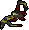

# Offering

Apart from [offering bones](../skills/prayer/) to the chaos altar in the wilderness, there are other items which utilise the `/offer` command. Here is a list:&#x20;

 **Unsired**

* `/offer`` `**`name:`**` ``Unsired`

 **Chewed bones**

* `/offer`` `**`name:`**` ``Chewed bones`

 **Long bone**

* `/offer`` `**`name:`**` ``Long bone`
* Provides 4,500 Construction Xp per bone

 **Curved bone**

* `/offer`` `**`name:`**` ``Curved bone`
* Provides 6,750 Construction Xp per bone

.png).png).png) **Bird Eggs**

* `/offer`` `**`name:`**` ``Red bird egg`
* `/offer`` `**`name:`**` ``Green bird egg`
* `/offer`` `**`name:`**` ``Blue bird egg`
