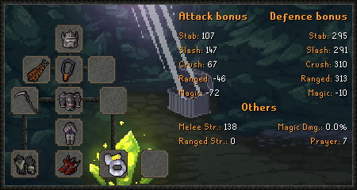

# Theatre of Blood (ToB)

The Theatre Of Blood is a high-level raid you can do for some good loot. You get faster, and better, at ToB after more attempts and KC.

You can do the Theatre of Blood using +tob start, you can make the raid automatically start when 4 people join, doing `+tob start 4` (or replace with another number).

You can do `+tob start --hard` to start a Hard mode raid.

You can find a team to do ToB in the official server at discord.gg/ob

You can see your KC, attempts and death chances using `+tob`

## Requirements

* 90 Attack/Strength/Defence/Range, 94 Magic, 77 Prayer
* Your best melee/mage gear equipped, and range gear (void highly recommended).&#x20;
* Enough GP to pay 100k if you die
* Rune pouch
* An Abyssal tentacle, Blade of saeldor(c) or Scythe of Vitur, and Fire or Infernal cape, in melee gear.
* A charged/loaded Toxic blowpipe in your bank, with good darts
* A magic shortbow or twisted bow in your range gear, with amethyst/rune/dragon arrows.
* Atleast 250 KC and an Infernal cape for Hard mode
* Atleast 300 KC before doing duos
* Super combat potions, ranging potions, brews, restores, blood runes, death runes, water rune
* Karambwans if you're less than 20 kc
* 20+ HP healing food (e.g. sharks) (more if less than 20 kc)
* Vials of blood and extra blood runes if using Scythe

## Gear

This is the best-in-slot gear you can wear - only needed until you reach 95.3% boost score.

.png>)

## Boosts

### Speed Boosts

There are no direct speed boosts, these items affect your boost score (see theory section).

* Better darts directly affect your boost score rather than your gear score.
* Having more attempts/KC
* Scythe > Blade > Tentacle (in melee outfit)
* Twisted bow (in range outfit)
* Dragon warhammer > Bandos godsword (in bank)
* Penalty for not having elite void, bigger penalty for not having normal void either.
* Dragon claws > Crystal halberd (in bank)

### Death Reduction

* Having more attempts/KC
* Having better gear

## Blowpipe, Abyssal Tentacle, Sanguinesti staff and Scythe of Vitur

You can charge the Blowpipe using: `+m blowpipe add 100 dragon dart, 1000 zulrah's scales`

You can create an Abyssal Tentacle using: `+create Abyssal tentacle`

You can add charges to your Abyssal Tentacle using `+m charge tent, 1`

You can charge a Sanguinesti Staff using `+m charge sang, 1000` - this has no use a ToB.&#x20;

The Scythe isn't charged. It is created from an uncharged scythe with `+create scythe of vitur` and uses blood runes/vials of blood as you use it.
