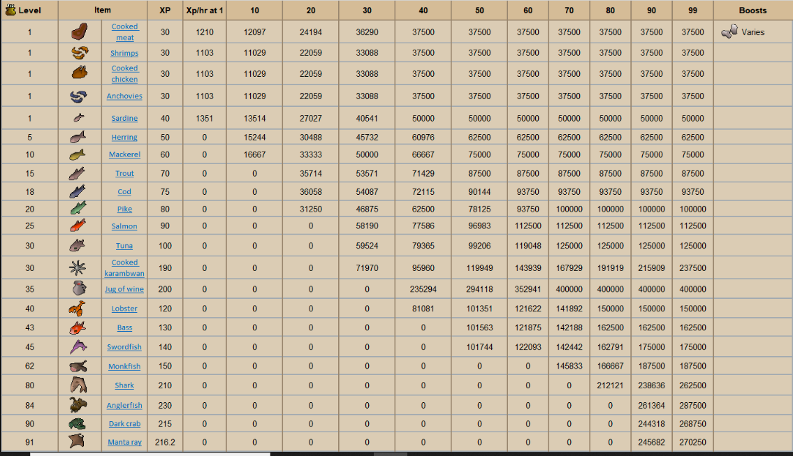
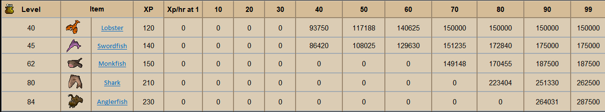

# Cooking Training

 **Optimal Cooking to 99** 

+cook 25 Sardine \(Until 5\)  
+cook 120 Herring \(Until 15\)  
+cook 75 Trout \(Until 20\)  
+cook 108 Pike \(Until 25\)   
+cook 155 Salmon \(Until 30\)   
+cook 300 Karambwan \(Until 35\)   
+cook Jug of wine \(Repeat until 99\)

Materials Needed:  
25 Raw sardine and 120 Raw herring  
75 Raw trout and 108 Raw pike  
155 Raw salmon and 300 Raw karambwan  
66000 Grapes and 66000 Jug of water

[Full Image](https://i.imgur.com/iJuoDbb.png)

[Full Image](https://i.imgur.com/b2ZV8NE.png)

