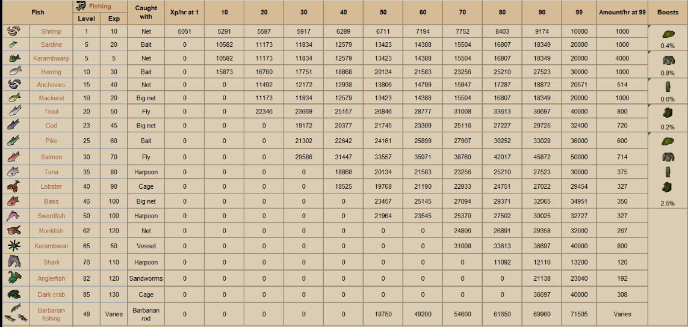

# Fishing Training

## Fastest route to 99:

Shrimp 1-5  
Sardine 5-10 \(requires fishing bait\)  
Herring 10-20 \(requires fishing bait\)  
OPTIONAL: Fishing Trawler until Angler \(equip set for 2.5% xp boost\)  
Trout 20-30 \(requires feathers\)  
Salmon 30-58 \(requires feathers\)  
OPTIONAL: Aerial Fishing \(reqs minimum 35 hunter\) until Pearl barbarian rod \(equip for 5% catch boost\)  
Barb Fishing 58-99 \(requires feathers\)

Tempoross is a good option instead of Barbarian Fishing once you have a crystal harpoon from Zalcano. Requires 35 fishing.

### Additional Information:

Aerial Fishing when at least 43 fishing/35 hunter, this is much better than doing Hunting or Fishing on their own for training if you're looking to get 99 in both.

Collection log slots from: Bass \(Big Bass\), Swordfish \(Big Swordfish\), Shark \(Big Shark\), Fishing Trawler \(Angler outfit\), Aerial Fishing \(3 Rods+Golden Tench+Fish Sack\).

 

[Full Image](https://i.imgur.com/0PUaA3J.png)

