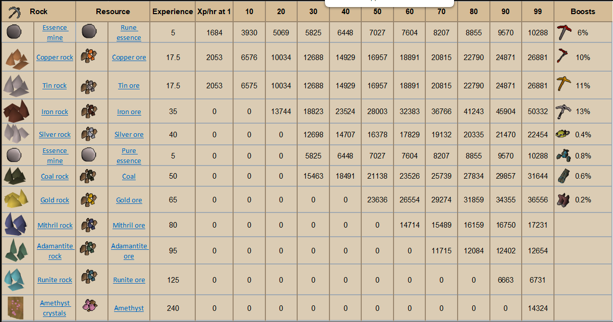

# Mining Training

## Fastest Route to 99

1-35: Copper/Tin&#x20;

35-50: Iron&#x20;

50-99: Volcanic Mine

It's recommended to get the prospector's outfit by mining gold if you plan on doing a lot of mining. For Volcanic Mine, you should get a crystal pickaxe as soon as possible as it provides a massive (50%) boost.

You can create a crystal pickaxe with `/create`` `**`item:`**` ``Crystal pickaxe`. You can obtain a crystal tool seed from [Zalcano](../../minigames/zalcano.md).

