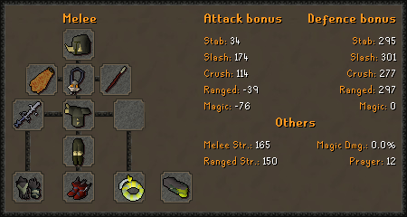
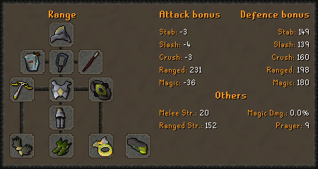
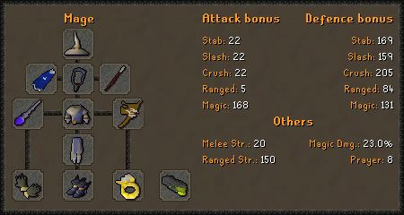

# Misc Info & FAQ

### FAQ

**Q: How do I use an unsired / Chewed bones?**  
A: `+offer unsired` / `+offer chewed bones`

**Q: What unlocks should I prioritise?**  
A: Superiors, blocks, task extensions. Slayer helm offers no advantages over a black mask. ****

**Q: How do I unlock/create a slayer helm?**  
A: `+sls unlock slayer helmet` followed by `+create slayer helmet` or `+create slayer helmet (i)`. This isn't recommended as a black mask can be used anywhere.

**Q: Which slayer master should I use?**  
A: Depends on your goal; Konar for CL/XP or Duradel for bossing. Konar is better XP due to being able to complete tasks in any of Konar's assignable locations rather than a specific location \(the way it works in OSRS\).

**Q: How do I imbue my slayer helm/black mask?**  
A: `+sw imbue black mask` you can get soul wars points with the `+sw` command.

**Q: Do I need to equip my black mask/slayer helm to get the boost?**  
A: No, but its recommended you equip it in your misc \(or any other\) setup for fightcaves.

**Q: How do I get an arclight?**  
A: `+buy darklight` ; `+create arclight` - Requires 3 ancient shards.

**Q: How do I get a cannon?**  
A: `+buy dwarf multicannon`

**Q: Why am I using so many cannonballs?**  
A: Cannonballs are used at 16 per minute in single combat areas and 50 per minute in multi areas. This is intentional. XP works out to similar as in game.

**Q: How do I get an elemental/mind shield for wyverns?**  
A: `+buy mind shield`

### Best gear for slayer

Individual gear bonuses \(e.g. ranged attack, slash defence, etc.\) cap at 95% of their maximum in game value. These values can be found on the [OSRS Wiki](https://oldschool.runescape.wiki/w/Armour/Highest_bonuses). Due to attack values generally having easier to reach max values, this means it is best to prioritize reaching this 95% threshold, and then focus on maximizing defence afterwards.

#### Melee

Currently, only your **slash attack** is taken into account. The 95% threshold for slash attack is 172.9.

#### Range

The 95% threshold for ranged attack is 230.85.

#### Mage

The 95% threshold for magic attack is 168.15.

It is also reccomended to equip a Black Mask \(i\) / Slayer Helmet \(i\) and a Saradomin Godsword in your Misc. setup for Jad tasks, as well as a staff of water \(or any other staff that gives water runes\) in your skilling setup. \(if you don't have a Kodai\)

It's recommended you create a gear preset for these setups after equipping them. I.E.  
`+gearpresets new meleeslay melee  
+gearpresets new rangeslay range  
+gearpresets new mageslay mage`  
Equip the presets with:  
`+gearpresets equip meleeslay melee`

### Konar specific

Konar assigns tasks to specific locations, you can use any location that Konar can assign in game. For example Konar assigns black demons in both the catacombs and taverly dungeon, allowing you to use a cannon or not use a cannon to receive ancient shards/totem pieces. Konar does not however assign the area for demonic gorillas meaning these won't count towards a black demon task.

_In simpler terms..._  
Konar assigns tasks to specific locations, slightly different to in game. Therefore you may not be able to kill your relevant task’s ‘boss’ counterparts or use a cannon/barrage.

